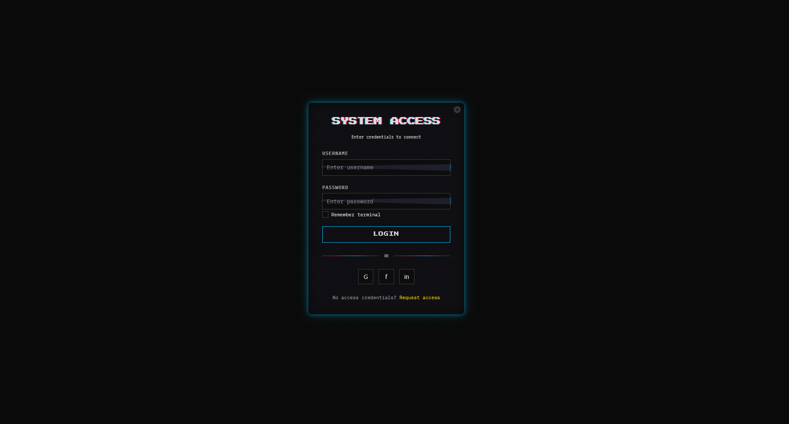

# Analog Glitch Aesthetic Login

A distorted login interface inspired by analog technology errors, VHS artifacts, and digital decay, featuring scan lines, chromatic aberration, and glitchy animations that create an unsettling yet nostalgic experience reminiscent of corrupted video playback and malfunctioning electronics.

<div align="center">



</div>

## 📼 About Analog Glitch Aesthetic

Analog Glitch Aesthetic embraces the beauty of technological imperfection, deliberately incorporating errors and artifacts from obsolete media. This design philosophy celebrates:

- VHS tracking errors and scan lines from cathode ray tube displays
- Chromatic aberration with RGB color splitting and channel displacement
- Corrupted signal patterns and random visual noise
- Unstable elements that flicker, shift, and distort
- Nostalgic references to 80s/90s electronic interfaces
- Deliberate digital decay and data corruption
- Tension between technological precision and chaotic failure

This approach creates interfaces that evoke nostalgia while subverting expectations of digital perfection, offering a raw, emotional experience that contrasts sharply with the polished interfaces of contemporary design.

## 🖥️ Components

This implementation includes:

- CRT screen effect with scan lines and screen curvature
- Random VHS tracking error animations that disrupt the interface
- RGB color splitting on text elements and buttons
- Static noise overlay with variable opacity
- Glitching input fields with displacement and distortion
- Animated channel shifting on hover states
- Flickering elements with randomized timing
- Television-style power button with on/off functionality
- Retro monospace and pixel typography
- Corrupted divider lines with animated glitch effects
- VHS-era color schemes with high contrast
- Terminal-inspired form elements

## 🛠️ Customization

### Color Schemes

The current implementation uses a cyberpunk VHS palette:

- Background: #0a0a0a (near black)
- Text: #e0e0e0 (off-white)
- Glitch Primary: #ff0048 (hot pink)
- Glitch Secondary: #00c3ff (cyan blue)
- Glitch Tertiary: #ffd900 (bright yellow)

Alternative analog glitch color combinations:

- Betamax: Purples, blues and static grays
- VCR: Deep blacks, neon greens and white noise
- Analog TV: Green/magenta RGB separation with yellow glow
- Corrupted Digital: Red, green, blue channel separation on black
- Vaporwave Glitch: Pastel pink, blue and purple with video noise

### Typography

This design uses a combination of:

- VT323 (pixel monospace) for computer terminal text
- Press Start 2P for headings and important UI elements
- IBM Plex Mono for form elements and body text

Other effective glitch typography combinations:

- Courier Prime + Major Mono Display
- DotGothic16 + Space Mono
- Silkscreen + Source Code Pro
- Fragments + JetBrains Mono
- VCR OSD Mono + Roboto Mono

## 🔌 Usage

To implement this design in your project:

1. Copy the HTML structure
2. Include the CSS variables and styles
3. Add the JavaScript for interactive elements

```html
<div class="tracking-error"></div>

<div class="container">
  <div class="tv-screen">
    <div class="tv-button"></div>

    <div class="login-header">
      <h1 class="login-title">System Access</h1>
      <p class="subtitle">Enter credentials to connect</p>
    </div>

    <form class="login-form">
      <div class="form-group">
        <label for="username" class="form-label">Username</label>
        <div class="glitch-input">
          <input
            type="text"
            id="username"
            class="form-input"
            placeholder="Enter username"
          />
        </div>
      </div>

      <!-- More form elements -->
    </form>
  </div>
</div>
```

## 📚 Resources

- [Glitch Art Resource Guide](https://www.vice.com/en/article/mgpbxa/glitch-art-resource-guide)
- [The Aesthetics of Failure](https://www.researchgate.net/publication/220430387_The_aesthetics_of_failure_Post-digital_tendencies_in_contemporary_computer_music)
- [VHS Aesthetic Design Principles](https://designmodo.com/vhs-aesthetic/)
- [Glitch Art Tutorials](https://glitchet.com/resources)
- [Understanding Analog Video Signals](https://www.maximintegrated.com/en/design/technical-documents/tutorials/7/734.html)
- [Digital Decay: Embracing Technology's Errors](https://www.smashingmagazine.com/2013/07/authenticity-in-design/)
