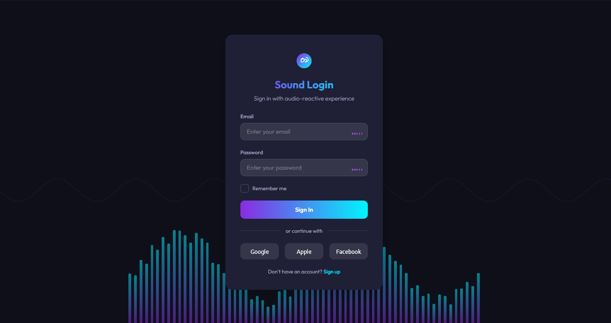

# Audio-Reactive Design

A dynamic interface approach that responds to sound input, creating visual feedback and interactions that synchronize with audio, producing an immersive multi-sensory experience.

<div align="center">



</div>

## 🎯 About Audio-Reactive Design

Audio-Reactive Design creates immersive digital experiences by establishing a direct relationship between sound and visual elements. This approach transforms passive interfaces into dynamic, responsive environments that react to music, voice, or ambient sounds. Key characteristics include:

- Real-time visual responses to audio input from microphones or audio files
- Frequency analysis that maps different sound ranges to specific visual elements
- Amplitude-based animations that scale, pulse, or transform with volume changes
- Waveform visualizations that represent sound patterns graphically
- Interactive elements that provide audio feedback when engaged
- Dynamic color shifts and effects triggered by sound characteristics
- Rhythm-synchronized animations that match musical beats
- Voice-activated interface elements and controls
- Sound-responsive typography that morphs or animates with audio input
- Multi-sensory feedback loops between user actions and audiovisual responses

## 🖥️ Components

This implementation includes:

- Frequency spectrum analyzer with responsive vertical bars
- Audio waveform visualization with real-time rendering
- Microphone integration with permission management
- Sound-reactive form elements that respond to voice and typing
- Audio-feedback system for user interactions
- Pulsating elements synchronized with sound levels
- Background effects that respond to audio intensity
- Audio-reactive borders and highlights
- Sound-driven animation timings
- Fallback animations for users without microphone access

## 🛠️ Customization

### Color Schemes

The current implementation uses a purple and teal gradient theme. Other effective audio-reactive color schemes include:

- Sound-to-color mapping (different frequencies trigger different colors)
- Volume-to-brightness relationship (louder sounds = brighter elements)
- Beat-detection color shifts for music applications
- Voice-recognition color indicators
- Spectrum-based gradients that shift with frequency ranges
- Equalizer-inspired color patterns

### Typography

This design uses:

- Outfit (modern, clean sans-serif that works well with animated elements)

Other appropriate fonts:

- Montserrat
- Inter
- Rubik
- SF Pro Display
- Poppins

## 🔌 Usage

To implement this design in your project:

1. Set up an audio context to access microphone or audio input
2. Use the Web Audio API to analyze frequency data
3. Map audio data to visual element properties
4. Create responsive animations based on sound characteristics

```html
<!-- Audio-Reactive Element Example -->
<div class="audio-visualizer">
  <div class="audio-bars"></div>
  <canvas class="waveform"></canvas>
</div>

<!-- Audio-Reactive Input Example -->
<div class="input-wrapper">
  <input type="text" class="sound-reactive-input" />
  <div class="audio-level-indicator">
    <div class="level-bar"></div>
    <div class="level-bar"></div>
    <div class="level-bar"></div>
  </div>
</div>
```

```javascript
// Basic Audio Analysis Setup
const audioContext = new (window.AudioContext || window.webkitAudioContext)();
const analyser = audioContext.createAnalyser();
analyser.fftSize = 256;

navigator.mediaDevices.getUserMedia({ audio: true }).then((stream) => {
  const microphone = audioContext.createMediaStreamSource(stream);
  microphone.connect(analyser);

  const dataArray = new Uint8Array(analyser.frequencyBinCount);

  function visualize() {
    analyser.getByteFrequencyData(dataArray);

    // Calculate average volume
    let sum = 0;
    for (let i = 0; i < dataArray.length; i++) {
      sum += dataArray[i];
    }
    const average = sum / dataArray.length;

    // Update UI elements with audio data
    document.querySelector(".reactive-element").style.transform = `scale(${
      1 + (average / 255) * 0.2
    })`;

    requestAnimationFrame(visualize);
  }

  visualize();
});
```

## 📚 Resources

- [Web Audio API Documentation](https://developer.mozilla.org/en-US/docs/Web/API/Web_Audio_API)
- [Creating Audio Visualizations](https://css-tricks.com/making-an-audio-waveform-visualizer-with-vanilla-javascript/)
- [Frequency Analysis with JavaScript](https://medium.com/better-programming/audio-visualization-with-javascript-and-the-web-audio-api-7a5e5152dae)
- [Sound Design for User Experience](https://www.smashingmagazine.com/2020/02/audio-user-experience-design/)
- [Creative Audio Visualization Techniques](https://tympanus.net/codrops/2018/03/06/creative-audio-visualizers/)
