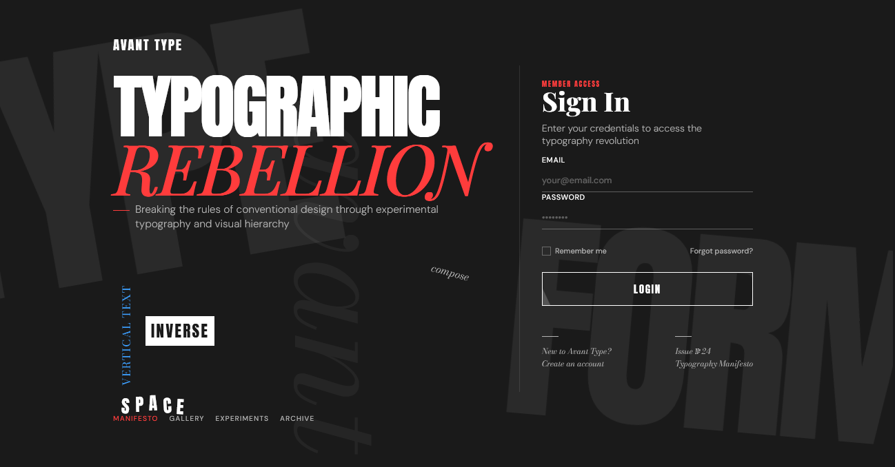

# Avant-garde Typography Login

A bold login interface inspired by experimental typography and editorial design, featuring oversized text, unconventional layouts, and dramatic juxtapositions that create a visually striking experience reminiscent of avant-garde art movements and modern design manifestos.

<div align="center">



</div>

## 📝 About Avant-garde Typography

Avant-garde Typography embraces experimental typographic layouts and treats text as a primary visual element, challenging conventional design rules:

- Typography as the dominant design element with minimal supporting graphics
- Dramatic scale contrasts between typographic elements for visual impact
- Unconventional text arrangements including vertical, overlapping and scattered layouts
- Deliberate breaking of typographic rules to create tension and interest
- Strategic use of negative space to enhance typographic elements
- Mix of typefaces for stylistic contrast and visual hierarchy
- Text that functions simultaneously as content and decoration
- Limited color palette that emphasizes typographic details and contrast
- Asymmetrical compositions that challenge traditional alignment and balance

This approach creates interfaces that feel bold, artistic and intellectual, elevating the user experience through principles that have been pioneered by design movements like Constructivism, Swiss Style, and Postmodernism.

## 🖥️ Components

This implementation includes:

- Oversized display typography that functions as both content and decoration
- Layered typographic background elements with varying opacity
- Vertical text orientations that break traditional reading patterns
- Scattered letters with randomized positioning for dynamic composition
- Contrasting font pairings (display, serif, sans-serif)
- Strong typographic hierarchy through size, weight, and positioning
- Strategic negative space to create visual tension
- Intentionally asymmetrical layout with editorial influences
- Minimalist form elements that complement the typographic focus
- Text-based navigation using typographic contrast
- Interactive type elements with subtle animations
- Footnote-style typographic details resembling editorial design

## 🛠️ Customization

### Color Schemes

The current implementation uses a high-contrast minimalist palette:

- Background: #1a1a1a (near black)
- Text Primary: #ffffff (white)
- Text Secondary: #b3b3b3 (light gray)
- Accent 1: #ff3c3c (bright red)
- Accent 2: #3c9fff (bright blue)

Alternative avant-garde typography color combinations:

- Constructivist: Black, red, and white with geometric accents
- Swiss Style: White background with black text and bold primary colors
- Postmodern: Black with neon accents and high contrast elements
- Brutalist: Monochrome with raw textures and minimal highlights
- De Stijl: Primary colors (red, blue, yellow) with black and white

### Typography

This design uses a combination of:

- Anton (display) for oversized headlines and impact elements
- Bodoni Moda (serif) for traditional contrast and editorial qualities
- DM Sans (sans-serif) for form elements and supporting text
- Playfair Display for decorative accents and contrast

Other effective avant-garde typography combinations:

- Helvetica Neue + Didot
- Futura + Garamond
- Univers + Baskerville
- Din + Times New Roman
- Akzidenz-Grotesk + Caslon

## 🔌 Usage

To implement this design in your project:

1. Include the CSS file
2. Add the Google Fonts
3. Copy the HTML structure
4. Add the JavaScript for animations

```html
<!DOCTYPE html>
<html lang="en">
  <head>
    <meta charset="UTF-8" />
    <meta name="viewport" content="width=device-width, initial-scale=1.0" />
    <title>Avant-garde Typography Login</title>
    <link
      href="https://fonts.googleapis.com/css2?family=Anton&family=Bodoni+Moda:ital,wght@0,400;0,700;1,400&family=DM+Sans:opsz,wght@9..40,300;9..40,500;9..40,700;9..40,900&family=Playfair+Display:ital,wght@0,400;0,800;1,400&display=swap"
      rel="stylesheet"
    />
    <link rel="stylesheet" href="style.css" />
  </head>
  <body>
    <div class="login-page">
      <div class="typo-decor typo-decor-1">TYPE</div>
      <div class="typo-decor typo-decor-2">FORM</div>
      <div class="typo-decor typo-decor-3">avant</div>

      <div class="container">
        <!-- Typography panel -->
        <div class="typography-panel">
          <!-- Content here -->
        </div>

        <!-- Login panel -->
        <div class="login-panel">
          <!-- Form content here -->
        </div>
      </div>
    </div>
  </body>
</html>
```

## 📚 Resources

- [A Brief History of Avant-garde Typography](https://www.smashingmagazine.com/2012/01/a-brief-history-of-typography/)
- [Breaking the Grid in Graphic Design](https://www.interaction-design.org/literature/article/breaking-the-grid-in-design)
- [Typography as Art Movement](https://www.designishistory.com/1920/typography/)
- [Experimental Typography Techniques](https://www.creativebloq.com/typography/experimental-typography-1131619)
- [The New Typography by Jan Tschichold](https://www.goodreads.com/book/show/248462.The_New_Typography)
- [Principles of Typographic Contrast](https://www.creativepro.com/eight-ways-to-vary-typographic-contrast/)
