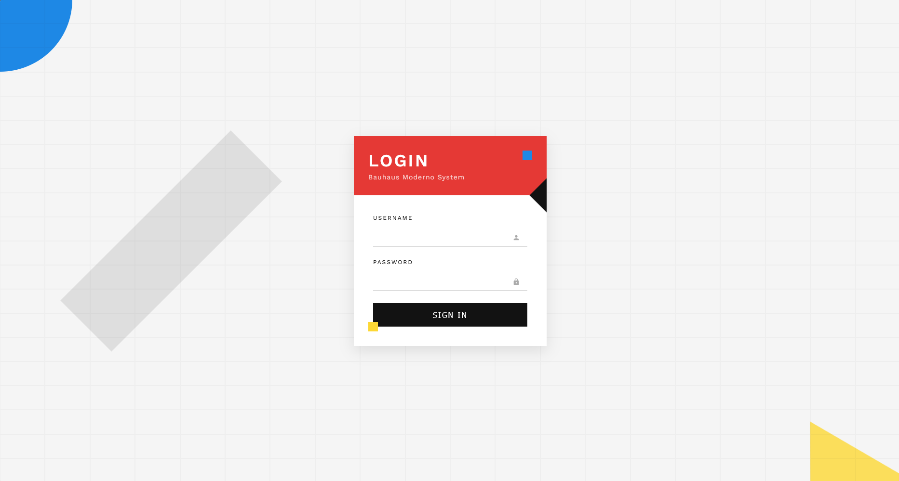

# Bauhaus Moderno

A contemporary interpretation of the iconic Bauhaus design movement, featuring geometric shapes, primary colors, and functional minimalism adapted for modern web interfaces.

<div align="center">



</div>

## 🟥 About Bauhaus Moderno

Bauhaus Moderno draws inspiration from the influential Bauhaus school (1919-1933) while adapting its principles for contemporary digital interfaces. Key characteristics include:

- Primary color palette (red, blue, yellow) with black and white
- Basic geometric shapes (circle, square, triangle) as design elements
- Form follows function philosophy
- Grid-based compositions with mathematical harmony
- Asymmetrical balance creating dynamic visual rhythm
- Sans-serif typography with clear hierarchy
- Reduction to essential elements without ornament

## 🖥️ Components

This implementation includes:

- Geometric shape overlays creating depth and visual interest
- Color block accents strategically positioned
- Minimalist form controls with subtle interaction feedback
- Background grid system honoring Bauhaus structural principles
- Careful spatial relationships between elements
- Primary color squares as decorative elements
- Clean typography with proper spacing and alignment

## 🛠️ Customization

### Color Schemes

The current implementation uses the classic Bauhaus primary colors. Alternative options include:

- Monochromatic approach with a single primary color
- Black and white with red accents only
- Modified primary colors (burgundy, navy, mustard)
- Complementary color pairs for primary elements

### Typography

This design uses:

- Work Sans (modern sans-serif in the Bauhaus tradition)

Other appropriate fonts:

- Futura
- Bayer Universal
- Avenir
- Neue Haas Grotesk
- Montserrat

## 🔌 Usage

To implement this design in your project:

1. Copy the HTML structure
2. Include the necessary font and styles
3. Maintain the geometric elements and color principles

```html
<link
  href="https://fonts.googleapis.com/css2?family=Work+Sans:wght@400;600&display=swap"
  rel="stylesheet"
/>
<link rel="stylesheet" href="style.css" />

<div class="login-container">
  <div class="login-header">
    <h1>Your Title</h1>
    <div class="subtitle">Subtitle Text</div>
    <div class="color-square blue-square"></div>
  </div>
  <div class="login-form">
    <div class="color-square yellow-square"></div>
  </div>
</div>
```

## 📚 Resources

- [Bauhaus Movement History](https://www.theartstory.org/movement/bauhaus/)
- [Principles of Bauhaus Design](https://www.widewalls.ch/magazine/bauhaus-design)
- [Geometric Abstraction in UI Design](https://uxdesign.cc/geometric-abstraction-in-ui-design-65288d58472)

## 📷 Gallery
