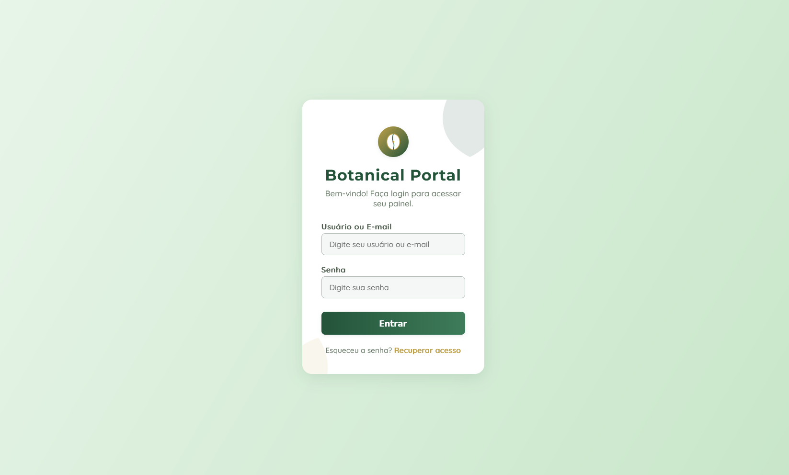

# Botanical UI Login

<div align="center">



</div>

## 🌿 About the Botanical Design

Botanical Design brings nature elements to digital interfaces, creating an elegant and professional login experience through:

- Subtle dark green and gold tones that evoke nature and sophistication
- Stylized botanical elements using SVG for minimalist decoration
- Organic and rounded shapes inspired by leaves and plants
- Soft gradients reminiscent of natural lighting
- Balance between white space and decorative elements
- Carefully selected typography to convey clarity and elegance

This design creates a welcoming and professional interface that connects users to nature while maintaining high usability.

## 🛠️ Customization

### Color Scheme

The design uses CSS variables for easy customization:

```css
:root {
  --primary: #24543a;    /* Main botanical green */
  --secondary: #e8f5e9;  /* Light green background */
  --accent: #bfa14a;     /* Gold for highlight elements */
  --input-bg: #f5f7f6;   /* Soft background for inputs */
  --input-border: #b2bdb5; /* Discrete borders */
}
```

### Typography

This interface combines:

- Montserrat (weight: 600, 700) for titles and headings
- Quicksand (weight: 500) for text and inputs

Other effective combinations for botanical interfaces:
- Playfair Display + Raleway
- Cormorant Garamond + Open Sans
- Libre Baskerville + Source Sans Pro

## 🔌 Usage

To implement this design in your project:

1. Copy the HTML structure
2. Include the CSS variables and styles
3. Keep the SVG elements or replace them with your own botanical decorations

```html
<div class="login-container">
  <!-- Decorative SVG leaves -->
  <svg class="leaf-bg" viewBox="0 0 120 120">
    <path fill="#24543a" d="M60 0C20 30 0 90 60 120C120 90 100 30 60 0Z"/>
  </svg>
  
  <div class="login-logo"><!-- Logo here --></div>
  <div class="login-title">Botanical Portal</div>
  <div class="login-subtitle">Welcome! Log in to access your dashboard.</div>
  
  <form class="login-form">
    <!-- Form fields -->
  </form>
</div>
```

## 📚 Resources

- [Nature-inspired design](https://www.interaction-design.org/literature/article/biophilia-the-benefits-of-nature-inspired-design)
- [Color theory in user interface](https://material.io/design/color/the-color-system.html)
- [Typography for web interfaces](https://www.smashingmagazine.com/2018/06/reference-guide-typography-mobile-web-design/)
- [SVG in modern web](https://css-tricks.com/using-svg/)
- [Effective minimalist design](https://www.nngroup.com/articles/characteristics-minimalism/)