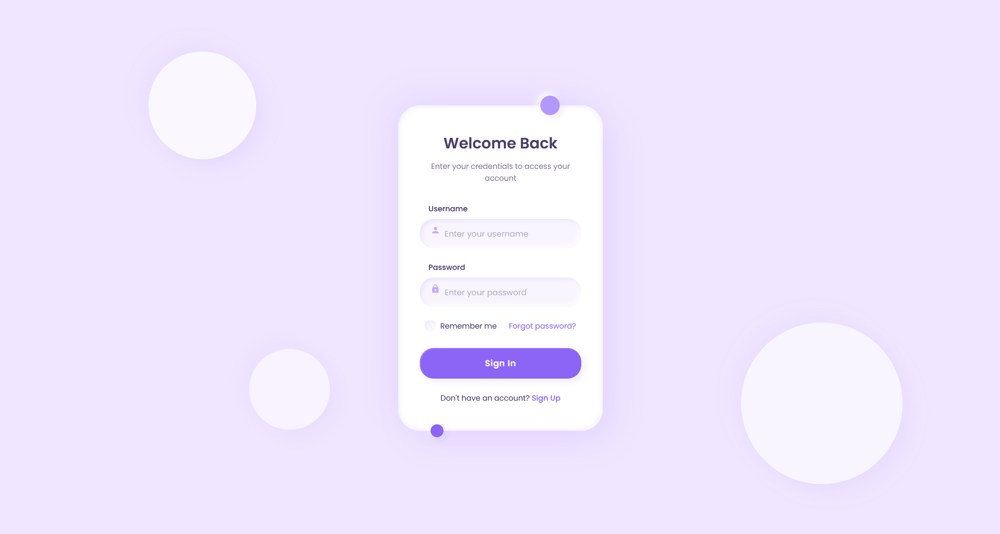

# Claymorphism

A modern design trend featuring soft, puffy interface elements with rounded corners and subtle shadows that mimic the appearance of clay or plasticine shapes.

<div align="center">



</div>

## 🧩 About Claymorphism

Claymorphism emerged as a UI design trend that creates a tactile, three-dimensional appearance through soft shapes and layered shadows. Key characteristics include:

- Soft, rounded elements that appear puffy and "squeezable"
- Multi-layered shadows creating depth perception
- High padding and rounded corners
- Pastel or muted color palettes
- Inset and outset shadow combinations
- Floating elements with clear separation
- Subtle background textures or gradients
- Generous spacing between elements

## 🖥️ Components

This implementation includes:

- Clay-like card container with soft shadows
- Custom form inputs with inset effects
- Interactive button with press animation
- Custom checkbox with clay-like appearance
- Decorative clay blobs in background
- Soft circular accents
- Layered shadow techniques
- Proper depth perception between elements

## 🛠️ Customization

### Color Schemes

The current implementation uses a soft purple palette. Alternative claymorphic color schemes include:

- Pastel blues and creams
- Soft mint green and coral
- Muted peach and turquoise
- Pale yellow and lavender
- Soft neutral grays and white

### Typography

This design uses:

- Poppins (rounded, friendly sans-serif)

Other appropriate fonts:

- Nunito
- Quicksand
- DM Sans
- Comfortaa
- Varela Round

## 🔌 Usage

To implement this design in your project:

1. Copy the HTML structure
2. Include the necessary font and styles
3. Maintain the soft shadow techniques

```html
<link
  href="https://fonts.googleapis.com/css2?family=Poppins:wght@400;500;600&display=swap"
  rel="stylesheet"
/>
<link rel="stylesheet" href="style.css" />

<div class="login-container">
  <div class="login-header">
    <h2>Your Title</h2>
    <p>Supporting text here</p>
  </div>

  <div class="form-group"></div>

  <button type="submit" class="login-button">Button Text</button>
</div>
```

## 📚 Resources

- [Understanding Claymorphism in UI Design](https://hype4.academy/articles/design/claymorphism-in-user-interfaces)
- [Creating Clay-like Elements with CSS](https://css-tricks.com/clay-effects-with-css/)
- [Shadow Techniques for Depth](https://uxdesign.cc/neumorphism-in-user-interfaces-b47cef3bf3a6)
