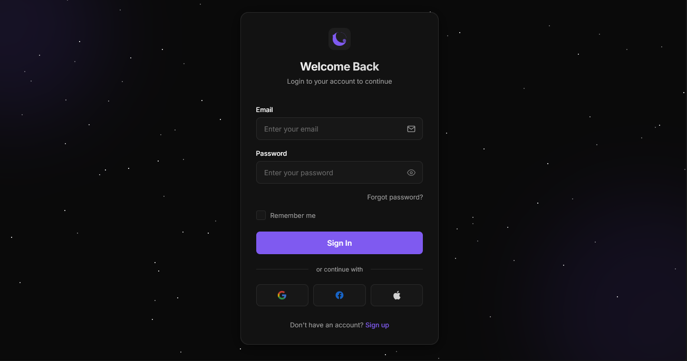

# Dark Mode Exclusive

A design approach that prioritizes dark color schemes as the primary experience, featuring optimized contrast, reduced eye strain, and carefully crafted UI elements specifically designed for low-light environments.

<div align="center">



</div>

## 🎯 About Dark Mode Exclusive

Dark Mode Exclusive design goes beyond simply inverting colors to create interfaces specifically crafted for low-light environments. This approach considers visual hierarchy, eye strain reduction, and atmospheric aesthetics as primary design goals rather than afterthoughts. Key characteristics include:

- True black and deep gray backgrounds that minimize eye strain and save power on OLED displays
- Carefully calibrated contrast ratios that maintain readability without causing visual fatigue
- Strategic use of accent colors that provide visual interest without overwhelming the dark canvas
- Subtle glow effects and illumination that create depth without harsh brightness
- Reduced white space in favor of balanced negative space that feels intentional
- Specialized typography choices optimized for legibility against dark backgrounds
- Shadow and elevation systems designed specifically for dark environments
- Dark-optimized UI components that maintain usability with appropriate contrast
- Atmospheric visual effects like gradients and blurs that enhance the immersive quality
- Thoughtful animation and transition effects that feel natural in low-light contexts

## 🖥️ Components

This implementation includes:

- Dark-optimized login form with carefully designed input fields
- Custom checkboxes designed specifically for dark interfaces
- Subtle glow effects that provide visual feedback without harshness
- Animated background elements with twinkling stars and gradient orbs
- Dark-optimized buttons with appropriate hover states
- Shadow systems designed for dark backgrounds
- Custom social login buttons with appropriate contrast
- Form validation styled for dark environments
- Password visibility toggle with dark mode appropriate icons
- Carefully styled text with optimal contrast for dark backgrounds

## 🛠️ Customization

### Color Schemes

The current implementation uses a deep purple accent on dark gray/black backgrounds. Other effective dark mode color schemes include:

- Deep blue (#2D46B9) with lighter blue accents
- Dark teal (#1A5E63) with mint highlights
- Amber (#FF8A00) on near-black backgrounds for high contrast
- Dark olive (#556B2F) with sage green accents for a natural feel
- Burgundy (#800020) with pink highlights for rich contrast
- Midnight blue (#191970) with ice blue accents

### Typography

This design uses:

- Inter (modern sans-serif optimized for screen readability)

Other appropriate fonts for dark mode:

- SF Pro Display
- Roboto
- Montserrat
- Open Sans
- Source Sans Pro
- Nunito

## 🔌 Usage

To implement this design in your project:

1. Use the dark color palette variables
2. Implement the custom form components
3. Add the subtle animation effects
4. Include the background elements

```html
<!-- Dark Mode Card Example -->
<div class="login-container">
  <!-- Card glow effect -->
  <div class="card-glow"></div>

  <div class="login-header">
    <div class="dark-mode-logo">
      <div class="logo-moon"></div>
      <div class="logo-stars">
        <div class="logo-star"></div>
        <div class="logo-star"></div>
        <div class="logo-star"></div>
      </div>
    </div>
    <h1 class="login-title">Welcome Back</h1>
    <p class="login-subtitle">Login to your account</p>
  </div>
</div>
```

```css
:root {
  --bg-primary: #0a0a0a;
  --bg-secondary: #121212;
  --bg-tertiary: #1e1e1e;
  --text-primary: #ffffff;
  --text-secondary: #a0a0a0;
  --accent: #7f5af0;
  --accent-secondary: #6b47d6;
  --accent-glow: rgba(127, 90, 240, 0.15);
  --border: #2a2a2a;
  --input-bg: #171717;
}

body {
  background-color: var(--bg-primary);
  color: var(--text-primary);
}

/* Custom dark mode form input */
.form-input {
  background-color: var(--input-bg);
  border: 1px solid var(--border);
  color: var(--text-primary);
}

.form-input:focus {
  border-color: var(--accent);
  box-shadow: 0 0 0 2px var(--accent-glow);
}
```

## 📚 Resources

- [Dark Mode Design Guidelines](https://material.io/design/color/dark-theme.html)
- [Designing for Dark Mode](https://www.smashingmagazine.com/2020/07/dark-mode-design/)
- [Accessible Color Contrast for Dark UI](https://uxdesign.cc/designing-for-dark-mode-d2e45ecc2d86)
- [Typography in Dark UI](https://designmodo.com/dark-mode-typography/)
- [OLED-Optimized Dark Mode Design](https://www.toptal.com/designers/ui/dark-ui-design)
