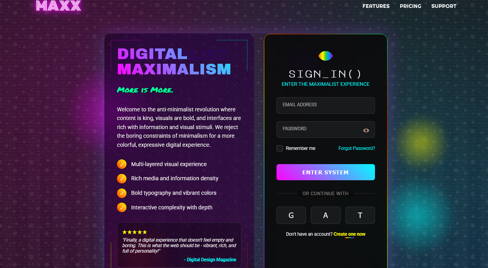

# Digital Maximalism Login

A visually abundant login interface that rejects minimalist constraints in favor of rich layers, vibrant colors, and complex visual elements, creating an immersive digital experience that celebrates information density and sensory stimulation.

<div align="center">



</div>

## ✨ About Digital Maximalism

Digital Maximalism stands in bold opposition to the minimalist design trend, embracing visual complexity and information richness. This design philosophy celebrates:

- Layered visual elements that create depth and dimension
- Vibrant, contrasting color palettes that stimulate the senses
- Multiple patterns and textures that interact and overlap
- Rich typography with varied fonts and treatments
- Animated elements that create constant visual movement
- Information density that rewards exploration
- Visual abundance that creates memorable experiences

Unlike minimalist interfaces that prioritize reduction, Digital Maximalism provides users with a rich tapestry of visual stimuli that creates a more engaging and emotionally resonant experience.

## 🖥️ Components

This implementation includes:

- Multi-layered background with overlapping visual elements
- Animated floating shapes with independent movement patterns
- Gradient text treatments with glow effects
- Custom cursor styling for different interaction states
- Pattern-based dividers and decorative elements
- Animated gradient borders on containers
- Multiple font combinations for typographic variety
- Interactive form elements with distinctive styling
- Dynamic shadows that respond to mouse movement
- Easter egg interactions for playful discovery
- Rich color palette with blend mode interactions
- Noise and grain textures for added visual depth

## 🛠️ Customization

### Color Schemes

The current implementation uses a cyber-neon palette:

- Primary: #ff00ff (magenta)
- Secondary: #00ffff (cyan)
- Tertiary: #ffff00 (yellow)
- Accents: #ff3300, #00ff99, #6600ff
- Background: Dark (#121212)

Alternative maximalist color combinations:

- Vaporwave: Pink, Purple, Teal, Bright Blue
- Neo-Baroque: Gold, Royal Blue, Burgundy, Emerald
- Cyberpunk: Neon Orange, Electric Blue, Acid Green, Hot Pink
- Psychedelic: Purple, Electric Green, Hot Pink, Bright Orange

### Typography

This design uses multiple font families for visual contrast:

- Monoton (logo)
- Archivo Black (headings)
- Major Mono Display (form title)
- Permanent Marker (subtitle)
- Righteous (navigation)
- Roboto (body text)

## 🔌 Usage

To implement this design in your project:

1. Copy the HTML structure
2. Include the CSS variables and styles
3. Add the JavaScript for interactive elements

```html
<!-- Background Layers -->
<div class="bg-layers">
  <div class="bg-layer layer-1"></div>
  <div class="bg-layer layer-2"></div>
  <div class="bg-layer layer-3"></div>
  <div class="bg-layer layer-4"></div>
  <div class="bg-layer layer-grain"></div>
</div>

<!-- Floating Elements -->
<div class="floating-elements">
  <div class="float float-1"></div>
  <div class="float float-2"></div>
  <div class="float float-3"></div>
</div>

<!-- Login Structure -->
<div class="login-container">
  <!-- Info Column -->
  <div class="info-column">
    <!-- Info content -->
  </div>

  <!-- Form Column -->
  <div class="form-column">
    <div class="form-border"></div>
    <!-- Form content -->
  </div>
</div>
```

```css
:root {
  --color-bg: #121212;
  --color-text: #ffffff;
  --color-primary: #ff00ff;
  --color-secondary: #00ffff;
  --color-tertiary: #ffff00;
  --color-accent1: #ff3300;
  --color-accent2: #00ff99;
  --color-accent3: #6600ff;
  --gradient-rainbow: linear-gradient(
    90deg,
    #ff0000,
    #ff9900,
    #ffff00,
    #33cc33,
    #0099ff,
    #6633cc,
    #ff00ff
  );
  --gradient-neon: linear-gradient(
    45deg,
    var(--color-primary),
    var(--color-secondary)
  );
}

/* Example of layered backgrounds */
.bg-layers {
  position: fixed;
  top: 0;
  left: 0;
  width: 100%;
  height: 100%;
  z-index: -1;
}

.bg-layer {
  position: absolute;
  top: 0;
  left: 0;
  width: 100%;
  height: 100%;
  opacity: 0.6;
  mix-blend-mode: screen;
}

/* Example of animated floating elements */
.float {
  position: absolute;
  border-radius: 50%;
  opacity: 0.5;
  mix-blend-mode: screen;
  filter: blur(10px);
  animation: float-animation 20s infinite linear;
}

@keyframes float-animation {
  0% {
    transform: translate(0, 0) rotate(0deg);
  }
  50% {
    transform: translate(50px, 50px) rotate(180deg);
  }
  100% {
    transform: translate(0, 0) rotate(360deg);
  }
}
```

## 📚 Resources

- [Digital Maximalism: The Anti-Minimalist Movement](https://uxdesign.cc/digital-maximalism-the-anti-minimalist-movement-dd02a54d0d66)
- [Maximalism in UI Design](https://www.smashingmagazine.com/2023/02/maximalism-future-web-design/)
- [The Return of 90s Web Design](https://www.webdesignerdepot.com/2019/09/the-return-of-90s-web-design/)
- [Visual Complexity in User Interfaces](https://www.nngroup.com/articles/visual-complexity/)
- [Color Theory for Digital Designers](https://www.toptal.com/designers/ui/color-in-ui-design)
- [Advanced CSS Animation Techniques](https://cssanimation.rocks/advanced-techniques/)
