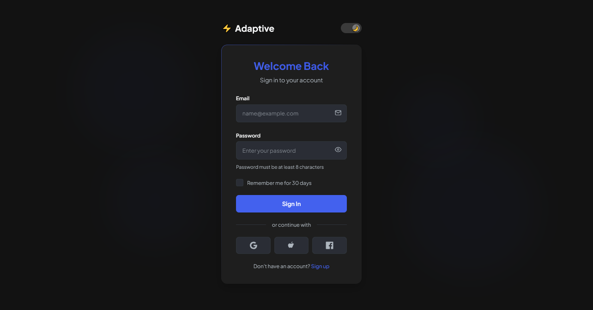
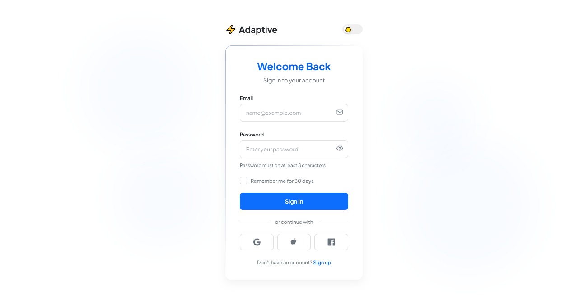

# Dynamic Theme Switching

A responsive login interface featuring smooth transitioning between light and dark modes with a circular animation effect, adapting to user preferences while maintaining visual consistency and accessibility.

<div align="center">




</div>

## 🌓 About Dynamic Theme Switching

Dynamic Theme Switching creates a modern, adaptable interface that seamlessly transitions between light and dark modes, respecting both user choice and system preferences. This design approach enhances accessibility and user comfort across different lighting conditions and contexts. Key characteristics include:

- Smooth circular animation when switching between themes
- Persistence of user theme preference using local storage
- System preference detection for initial theme setting
- Consistent component design that works well in both modes
- Carefully calibrated color variables for proper contrast in each theme
- Subtle background animations that enhance the interface without distraction
- Accessible focus states and interactive elements
- Thoughtful micro-interactions and visual feedback

## 🖥️ Components

This implementation includes:

- Animated theme toggle switch with icon indicators
- Circular theme transition effect that spreads from click position
- Form inputs with validation states and error messages
- Password visibility toggle with appropriate icons
- Custom checkbox with theme-aware styling
- Ripple effect on button interactions
- Floating background shapes with subtle animations
- Social login buttons with hover states
- Responsive layout that adapts to different screen sizes
- CSS variables system for theme color management

## 🛠️ Customization

### Color Schemes

The current implementation uses:

- Light mode: Clean white background with blue accent
- Dark mode: Dark gray/black with indigo accent

Alternative color scheme options include:

- Light mode with green accent + Dark mode with teal accent
- Light cream with amber accent + Dark brown with orange accent
- Light lavender with purple accent + Dark navy with violet accent
- Light mint with emerald accent + Dark forest with lime accent

### Typography

This design uses:

- Plus Jakarta Sans (modern, highly readable sans-serif)

Other appropriate fonts:

- Inter
- Rubik
- SF Pro Display
- Manrope
- DM Sans

## 🔌 Usage

To implement this design in your project:

1. Copy the HTML structure
2. Include the necessary font and styles
3. Add the JavaScript for theme switching

```html
<link
  href="https://fonts.googleapis.com/css2?family=Plus+Jakarta+Sans:wght@300;400;500;600;700&display=swap"
  rel="stylesheet"
/>
<link rel="stylesheet" href="style.css" />

<div class="theme-switch">
  <div class="brand">Your Brand</div>
  <div class="toggle">
    <input type="checkbox" id="themeToggle" class="toggle-input" />
    <label for="themeToggle" class="toggle-label"></label>
  </div>
</div>

<div class="theme-transition" id="themeTransition"></div>

<script src="theme-switcher.js"></script>
```

```javascript
// Theme switch functionality
document.addEventListener("DOMContentLoaded", function () {
  const themeToggle = document.getElementById("themeToggle");
  const themeTransition = document.getElementById("themeTransition");

  // Check for saved user preference
  let currentTheme = localStorage.getItem("theme");

  // Set initial theme
  if (currentTheme) {
    document.documentElement.setAttribute("data-theme", currentTheme);
    if (currentTheme === "dark") {
      themeToggle.checked = true;
    }
  } else {
    // Or use system preference
    const prefersDarkScheme = window.matchMedia(
      "(prefers-color-scheme: dark)"
    ).matches;
    if (prefersDarkScheme) {
      document.documentElement.setAttribute("data-theme", "dark");
      themeToggle.checked = true;
      localStorage.setItem("theme", "dark");
    }
  }

  // Handle theme toggle with animation
  themeToggle.addEventListener("click", function (e) {
    const newTheme = this.checked ? "dark" : "light";

    // Create circular transition effect from click point
    const x = e.clientX || window.innerWidth / 2;
    const y = e.clientY || window.innerHeight / 2;
    const size = Math.max(window.innerWidth, window.innerHeight) * 2;

    themeTransition.style.setProperty("--x", `${x}px`);
    themeTransition.style.setProperty("--y", `${y}px`);
    themeTransition.style.setProperty("--size", `${size}px`);
    themeTransition.classList.add("active");

    // Apply new theme after transition starts
    setTimeout(() => {
      document.documentElement.setAttribute("data-theme", newTheme);
      localStorage.setItem("theme", newTheme);

      setTimeout(() => themeTransition.classList.remove("active"), 500);
    }, 300);
  });
});
```

## 📚 Resources

- [Designing for Dark Mode](https://www.smashingmagazine.com/2020/07/dark-mode-design/)
- [CSS Variables for Theme Switching](https://css-tricks.com/theming-with-variables-globals-and-locals/)
- [Advanced CSS Animation Techniques](https://www.smashingmagazine.com/2020/09/advanced-css-animation-techniques/)
- [WCAG Color Contrast Guidelines](https://www.w3.org/WAI/WCAG21/Understanding/contrast-minimum.html)
- [Dark Mode User Preferences in JavaScript](https://developer.mozilla.org/en-US/docs/Web/CSS/@media/prefers-color-scheme)
