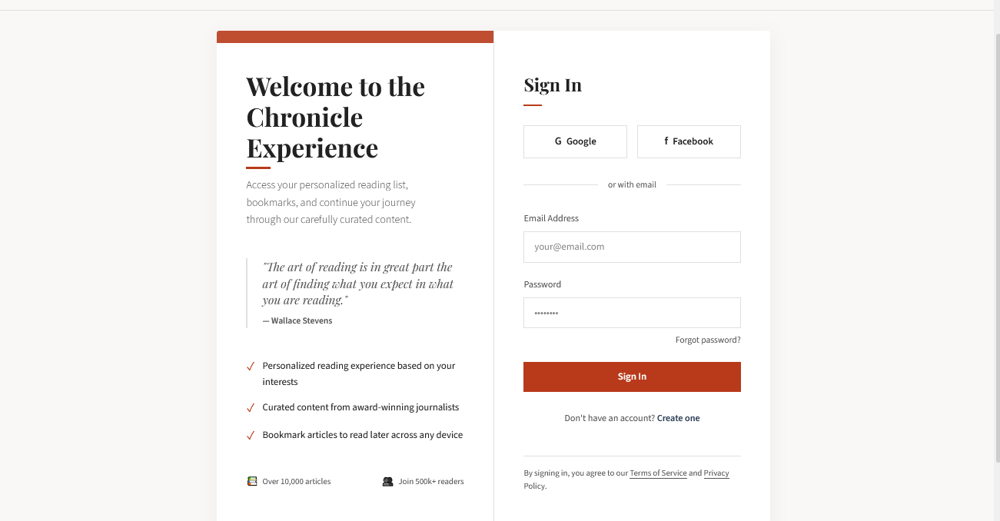

# Editorial Web Design Login

A sophisticated login interface inspired by print editorial layouts, featuring refined typography, balanced column structure, and thoughtful content presentation that creates a premium, content-focused user experience reminiscent of high-quality magazines and newspapers.

<div align="center">



</div>

## 📰 About Editorial Web Design

Editorial Web Design translates the refined aesthetic of print magazines and newspapers to digital interfaces. This design philosophy is characterized by:

- Typography-focused design with careful attention to font pairings, spacing, and hierarchy
- Column-based layouts that guide the eye in a natural reading pattern
- Generous use of whitespace to enhance readability and create visual breathing room
- Elegant decorative elements like drop caps, pull quotes, and subtle dividers
- Refined color palette with judicious use of accent colors
- Attention to typographic details such as proper quotation marks and dashes
- Balanced composition with carefully considered visual weight distribution

This approach creates interfaces that feel sophisticated and trustworthy, elevating the user experience through principles that have been refined over centuries of print design.

## 🖥️ Components

This implementation includes:

- Two-column layout inspired by magazine spreads
- Serif/sans-serif font pairing (Playfair Display and Source Sans 3)
- Editorial header with minimal navigation
- Pull quote with proper citation styling
- Feature list with subtle indicators
- Content metadata display similar to article attribution
- Form elements with refined styling
- Subtle dividers reminiscent of magazine layout separators
- Social login options with restrained styling
- Footnote section with underlined links
- Footer with secondary navigation
- Strategic use of accent color for emphasis

## 🛠️ Customization

### Color Schemes

The current implementation uses a classic editorial palette:

- Background: #f9f8f6 (off-white paper)
- Text: #222222 (near-black)
- Accent: #b83a1a (brick red)
- Secondary: #2e4057 (slate blue)
- Border: #e0e0e0 (light gray)

Alternative editorial color combinations:

- Classic News: Dark blue accent with black text on cream background
- Literary Magazine: Deep green accent with charcoal text on eggshell background
- Modern Editorial: Burnt orange accent with dark gray text on white background
- Academic Journal: Burgundy accent with black text on white background

### Typography

This design pairs:

- Playfair Display (serif) for headings and titles
- Source Sans 3 (sans-serif) for body text and UI elements

Other effective editorial font combinations:

- Merriweather + Open Sans
- Georgia + Helvetica
- Freight Text + Proxima Nova
- Tiempos + Graphik
- Minion Pro + Acumin Pro

## 🔌 Usage

To implement this design in your project:

1. Copy the HTML structure
2. Include the CSS variables and styles
3. Add the JavaScript for interactive elements

```html
<header class="site-header">
  <a href="#" class="site-logo">Chronicle<span></span></a>
  <nav class="header-nav">
    <a href="#" class="nav-link">Features</a>
    <a href="#" class="nav-link">About</a>
    <a href="#" class="nav-link">Contact</a>
  </nav>
</header>

<main class="main-content">
  <div class="login-container">
    <!-- Editorial content panel -->
    <div class="editorial-panel">
      <div class="editorial-pattern"></div>
      <h1 class="login-heading">Welcome to the Chronicle Experience</h1>
      <p class="login-intro">Access your personalized reading list...</p>

      <blockquote class="quote-block">
        <p class="quote-text">"The art of reading is in great part..."</p>
        <cite class="quote-author">— Wallace Stevens</cite>
      </blockquote>

      <!-- Features and metadata -->
    </div>

    <!-- Login form panel -->
    <div class="form-panel">
      <!-- Form elements -->
    </div>
  </div>
</main>
```
