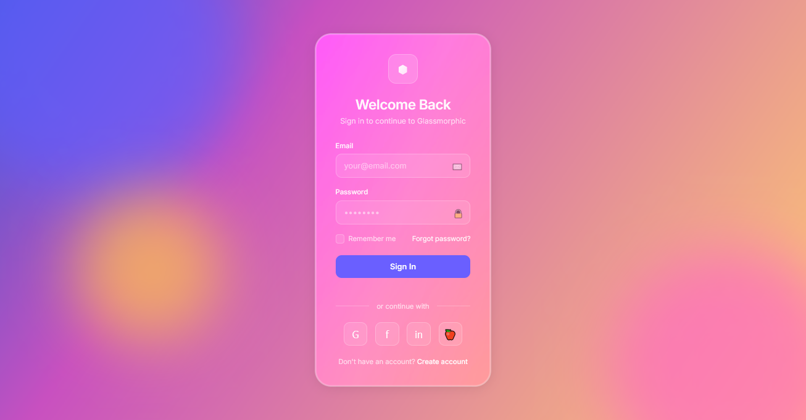

# Glass Morphism 2.0 Login

A modern login interface inspired by advanced glass material properties, featuring layered transparency, dynamic light reflections, and subtle animations that create an elegant, dimensional user experience reminiscent of frosted glass with depth and physicality.

<div align="center">



</div>

## ✨ About Glass Morphism 2.0

Glass Morphism 2.0 is an evolution of the original glass-inspired UI trend, introducing more sophisticated transparency handling and material simulation:

- Advanced layered transparency with optimized backdrop filters for realistic depth
- Refined edge treatments that simulate the physical properties of glass borders
- Dynamic light interactions including animated reflections and highlights
- Multi-layering techniques that create authentic dimensional hierarchy
- Vibrant background integration that shows through glass elements naturally
- Interactive feedback that maintains material consistency across states
- Enhanced contrast and legibility despite transparent elements
- Subtle animations that mimic light refraction and movement

This approach creates interfaces that feel tactile and dimensional while maintaining a modern aesthetic, striking a perfect balance between visual appeal and usability.

## 🖥️ Components

This implementation includes:

- Frosted glass card with optimized backdrop-filter properties
- Animated shine effect simulating light passing over glass surfaces
- Floating gradient shapes with subtle movements in the background
- Glass-styled form inputs with focus state enhancements
- Custom checkboxes with glass material properties
- Gradient-enhanced logo with reflection animation
- Social login buttons with glass hover effects
- Custom glass buttons with animated light reflection
- Dividers with refined glass border styling
- Responsive design with mobile optimizations
- Interactive shine animations triggered on focus

## 🛠️ Customization

### Color Schemes

The current implementation uses a vibrant gradient palette:

- Primary Background: Linear gradient from #4158D0 to #C850C0 and #FFCC70
- Glass Surface: rgba(255, 255, 255, 0.15) with blur effect
- Glass Border: rgba(255, 255, 255, 0.25)
- Accent: #6a5fff with #8f7aff highlight
- Text on Glass: rgba(255, 255, 255, 0.95) and rgba(255, 255, 255, 0.7)

Alternative glass morphism color combinations:

- Midnight: Deep blue gradient with light blue glass elements
- Arctic: Cool blue-white gradient with highly transparent glass
- Sunset: Orange-pink gradient with warm-tinted glass elements
- Forest: Green gradient with nature-inspired glass tinting
- Monochrome: Black and white with pure glass effect

### Customizing Variables

```css
:root {
  --glass-bg: rgba(255, 255, 255, 0.15); /* Glass panel background */
  --glass-border: rgba(255, 255, 255, 0.25); /* Glass edge highlight */
  --glass-highlight: rgba(255, 255, 255, 0.5); /* Strong light reflection */
  --glass-shadow: rgba(0, 0, 0, 0.1); /* Glass shadow effect */
  --text-primary: rgba(255, 255, 255, 0.95); /* Primary text color */
  --text-secondary: rgba(255, 255, 255, 0.7); /* Secondary text color */
  --accent: #6a5fff; /* Primary accent color */
  --accent-highlight: #8f7aff; /* Accent hover state */
  --border-radius-sm: 12px; /* Small border radius */
  --border-radius-md: 24px; /* Medium border radius */
  --border-radius-lg: 32px; /* Large border radius */
}
```

## 🔌 Usage

To implement this design in your project:

1. **Include the CSS file**
2. **Add the Google Font** `'Inter'`
3. **Copy the HTML structure**
4. **Add the JavaScript for animations**

```html
<!DOCTYPE html>
<html lang="en">
  <head>
    <meta charset="UTF-8" />
    <meta name="viewport" content="width=device-width, initial-scale=1.0" />
    <title>Glass Morphism 2.0 Login</title>
    <link
      href="https://fonts.googleapis.com/css2?family=Inter:wght@300;400;500;600;700&display=swap"
      rel="stylesheet"
    />
    <link rel="stylesheet" href="style.css" />
  </head>
  <body>
    <!-- Background shapes -->
    <div class="bg-shapes">
      <div class="bg-shape shape-1"></div>
      <div class="bg-shape shape-2"></div>
      <div class="bg-shape shape-3"></div>
    </div>

    <div class="login-container">
      <div class="glass-card">
        <div class="glass-shine"></div>

        <div class="login-header">
          <div class="logo">
            <div class="logo-icon">⬢</div>
          </div>
          <h1 class="login-title">Welcome Back</h1>
          <p class="login-subtitle">Sign in to continue to Glassmorphic</p>
        </div>

        <!-- Form content -->
        <form class="login-form">
          <!-- Form elements -->
        </form>
      </div>
    </div>

    <script>
      // Animation script
    </script>
  </body>
</html>
```
