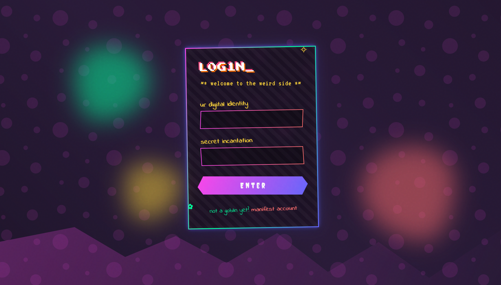

# Goblin Mode / Weird Core Login

## 🌀 About the Goblin Mode / Weird Core Design

Goblin Mode / Weird Core UI embraces chaos, nostalgia, and intentional discomfort. This login page features:

- Clashing neon and pastel colors with strange gradients
- Irregular, organic shapes and backgrounds
- Glitchy, pixel, and handwritten fonts (VT323, Press Start 2P, Creepster, Indie Flower)
- Animated noise, floating blobs, and cursor-follow effects
- Deliberately "wrong" alignments, rotations, and playful microinteractions
- Retro symbols and unconventional field labels

This style creates a surreal, nostalgic, and playful interface that feels both unsettling and fun.

## 🅰️ Typography

This interface uses:

- VT323, Press Start 2P, Creepster, Indie Flower, Comic Neue

Other good combinations for weirdcore/goblin mode:
- Rubik Mono One + Special Elite
- UnifrakturCook + Syne Mono

## 📚 Resources

- [Weirdcore Aesthetic](https://aesthetics.fandom.com/wiki/Weirdcore)
- [Goblin Mode Trend](https://www.nytimes.com/2022/06/07/style/goblin-mode-word-of-the-year.html)
- [Glitch Art Inspiration](https://glitchart.com/)
- [Animated Noise SVG](https://css-tricks.com/noise-texture-svg/)
- [Retro Fonts on Google Fonts](https://fonts.google.com/?category=Monospace,Display)