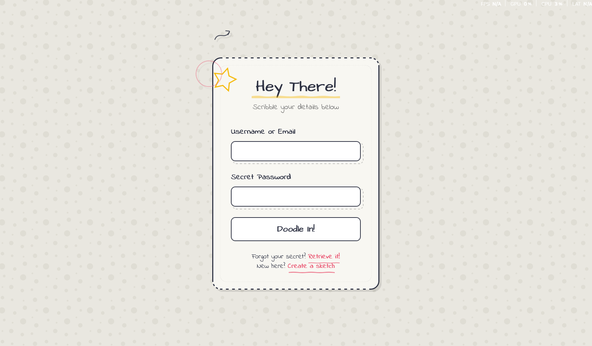

# Hand-drawn / Doodle UI Login

<div align="center">



</div>

## ✏️ About the Hand-drawn / Doodle Design

Hand-drawn (Doodle) UI brings a playful, creative touch to digital interfaces, simulating the look and feel of sketches and notebook doodles. This login page features:

- Borders and decorations that mimic hand-drawn lines and doodles
- Fun SVG elements like stars, arrows, and circles
- Organic, imperfect shapes and casual layout
- Playful handwritten fonts for headings and labels
- Interactive effects with bouncy buttons and animated highlights

This style creates a friendly, informal interface that feels personal and unique.

## 🛠️ Customization

### Color Scheme

The design uses CSS variables for easy customization:

```css
:root {
  --ink-dark: #2D3142;      /* Main ink color */
  --paper: #F8F7F2;         /* Paper background */
  --accent: #EA526F;        /* Accent (doodle) color */
  --pencil: #707070;        /* Pencil/doodle lines */
  --highlight: #F5B700;     /* Highlight color */
}
```

### Typography

This interface uses:

- Architects Daughter, Indie Flower, and Comic Neue for a hand-drawn, playful look

Other good combinations for doodle UIs:
- Permanent Marker + Patrick Hand
- Caveat + Gloria Hallelujah

## 🔌 Usage

To use this design in your project:

1. Copy the HTML structure
2. Include the CSS variables and styles
3. Keep or customize the SVG doodle elements as you like

```html
<div class="login-container">
  <!-- Doodle SVG decorations -->
  <svg class="doodle-star" ...></svg>
  <svg class="doodle-arrow" ...></svg>
  <div class="doodle-circle"></div>

  <div class="doodle-header">
    <h2>Hey There!</h2>
    <p class="subtitle">Scribble your details below</p>
  </div>

  <form class="doodle-form">
    <!-- Form fields -->
  </form>
</div>
```

## 📚 Resources

- [Hand-drawn UI inspiration](https://dribbble.com/tags/hand_drawn)
- [SVG for playful web design](https://css-tricks.com/using-svg/)
- [Handwritten Google Fonts](https://fonts.google.com/?category=Handwriting)
- [Microinteractions in UI](https://uxdesign.cc/microinteractions-what-they-are-and-why-they-matter-6c8f0e4e36c7)