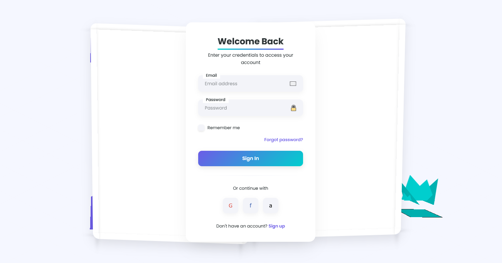

# Isometric Interface Design

A three-dimensional visual approach that creates the illusion of depth and perspective using geometric shapes and elements arranged on a fixed isometric grid system.

<div align="center">



</div>

## 🎯 About Isometric Interface Design

Isometric Interface Design creates engaging digital experiences through the use of three-dimensional elements projected onto a two-dimensional surface using isometric projection. This style maintains equal measurements along all three axes (width, height, and depth) to create a consistent and geometrically accurate representation of 3D space. Key characteristics include:

- Fixed 30° angle projection that maintains parallel lines without perspective distortion
- Equal measurement scale across all three dimensions (width, height, depth)
- Geometric shapes with precise shading to enhance depth perception
- Clean, structured layouts based on isometric grid systems
- Interactive elements that respond with dimensional movement
- Layered interface components positioned at different virtual depths
- Shadows and highlights that follow isometric principles
- Motion effects that respect the isometric spatial arrangement
- Balanced color schemes that differentiate planes and surfaces
- Playful, gamified interactions that leverage the 3D environment

## 🖥️ Components

This implementation includes:

- Isometric grid system as foundational layout
- 3D geometric primitives (cubes, pyramids, cylinders)
- Layered interface panels with proper depth shading
- Form elements with dimensional interactions
- Buttons with press/release depth animations
- Custom checkboxes with 3D transformation
- Floating elements with gentle animations
- Mouse-responsive parallax effects
- Shadow systems that reinforce the isometric illusion
- Depth-based navigation and hierarchy

## 🛠️ Customization

### Color Schemes

The current implementation uses a purple, teal, and pink color palette. Other effective isometric color schemes include:

- Blue and orange for high contrast and visibility
- Monochromatic with varying shades to emphasize shape
- Pastels for a softer, more playful aesthetic
- Earth tones for a natural, grounded feel
- Bold primary colors for a playful, game-like interface

### Typography

This design uses:

- Poppins (modern geometric sans-serif that complements the angular nature)

Other appropriate fonts:

- Montserrat
- Nunito
- Product Sans
- Futura
- Century Gothic

## 🔌 Usage

To implement this design in your project:

1. Set up the isometric grid system (typically at 30° angles)
2. Create 3D elements using CSS transforms
3. Implement the layering system for interface components
4. Add interactive depth effects to form elements

```html
<!-- Isometric Element Example -->
<div class="iso-element">
  <div class="iso-cube">
    <div class="face front"></div>
    <div class="face back"></div>
    <div class="face right"></div>
    <div class="face left"></div>
    <div class="face top"></div>
    <div class="face bottom"></div>
  </div>
</div>

<!-- Isometric Button Example -->
<div class="iso-btn-wrapper">
  <button class="iso-btn">Click Me</button>
  <div class="iso-btn-shadow"></div>
</div>
```

```css
/* Basic Isometric Transform */
.iso-element {
  transform: rotateX(60deg) rotateZ(45deg);
  transform-style: preserve-3d;
}

/* Button with Depth Effect */
.iso-btn {
  transform: translateZ(15px);
  transition: all 0.3s ease;
}

.iso-btn:hover {
  transform: translateZ(25px) translateY(-2px);
}

.iso-btn:active {
  transform: translateZ(5px) translateY(2px);
}
```

## 📚 Resources

- [Understanding Isometric Projection](https://www.smashingmagazine.com/2016/05/isometric-projection-in-css/)
- [CSS 3D Transforms](https://developer.mozilla.org/en-US/docs/Web/CSS/transform-style)
- [Creating Isometric Layouts with CSS](https://css-tricks.com/creating-isometric-layouts-css/)
- [Isometric Design in Web UI](https://www.uxpin.com/studio/blog/isometric-design-web-ui/)
- [Working with CSS in 3D Space](https://3dtransforms.desandro.com/)
