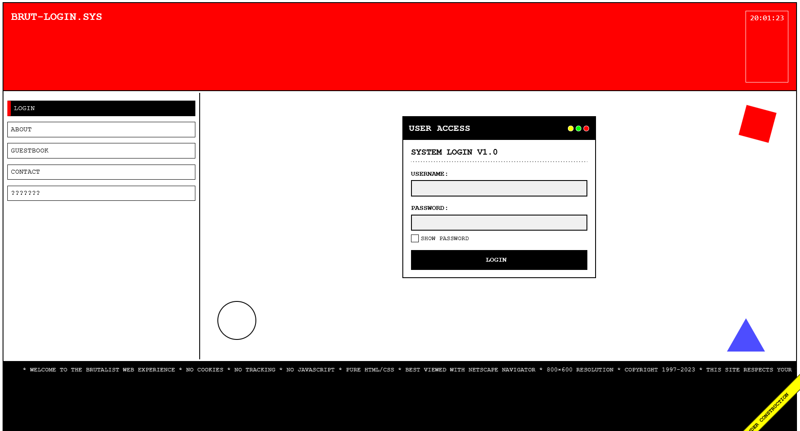

# Low-Fi Web Brutalism Login

A deliberately unpolished login interface embracing raw HTML aesthetics, visible structural elements, and nostalgic web references that create an anti-design experience reminiscent of early internet pages and brutalist architecture's honest approach to materials.

<div align="center">



</div>

## 🧱 About Low-Fi Web Brutalism

Low-Fi Web Brutalism intentionally rejects modern polish in favor of an honest, raw approach to web design that celebrates digital constraints and structural forms:

- Unfiltered aesthetics that expose rather than hide the underlying structure
- Intentionally crude layouts with visible borders and construction elements
- Stark typographic contrast with monospaced fonts and bold uppercase text
- Limited color palettes featuring high contrast combinations and primary colors
- Anti-design elements that challenge conventional user experience patterns
- Nostalgic references to early web design (marquees, under construction banners)
- Rejection of unnecessary ornamentation and decorative flourishes
- Functional interface elements presented in their most basic form
- Deliberate misalignments and disproportionate sizing for visual impact
- "Truth to materials" approach that embraces HTML's inherent boxiness

This approach creates interfaces that feel authentic and unpretentious, rejecting the homogenized sleekness of contemporary digital design in favor of character, personality, and a certain digital rawness.

## 🖥️ Components

This implementation includes:

- Visible grid system with explicit borders and structure
- Window-style UI with decorative minimize/maximize/close buttons
- "Under construction" diagonal banner typical of 90s web design
- Classic monospaced typography (Courier) for terminal-like appearance
- Primary color geometric shapes as purely decorative elements
- Marquee text footer with nostalgic web messaging
- High-contrast form elements with thick borders
- Intentionally basic navigation with active state indicators
- Blinking cursor animation for retro computing feel
- Custom checkbox styling with minimal design
- Digital clock display with monospace formatting
- Responsive design that maintains brutalist principles at all sizes

## 🛠️ Customization

### Color Schemes

The current implementation uses a classic brutalist palette:

- Background: #ffffff (white)
- Text/Borders: #000000 (black)
- Primary Accent: #ff0000 (red)
- Secondary Accents: #0000ff (blue), #ffff00 (yellow)

Alternative brutalist color combinations:

- Grayscale: Black, white, and shades of gray
- Primary: Red, yellow, blue with black and white
- Monochrome: Single accent color with black and white
- Screenshot: Green screen terminal colors
- Neon: Black background with bright neon accents

### Typography

This design uses:

- Courier (monospace) for all text elements

Other effective brutalist typography options:

- System UI (default system font)
- Times New Roman (web safe serif)
- Arial/Helvetica (basic sans-serif)
- Terminal/Console fonts
- Combinations of dramatically different typefaces

## 🔌 Usage

To implement this design in your project:

1. Copy the HTML structure
2. Include the CSS styles
3. Add the minimal JavaScript for functionality

```html
<!DOCTYPE html>
<html lang="en">
  <head>
    <meta charset="UTF-8" />
    <meta name="viewport" content="width=device-width, initial-scale=1.0" />
    <title>Low-Fi Web Brutalism Login</title>
    <link rel="stylesheet" href="style.css" />
  </head>
  <body>
    <div class="grid-container">
      <!-- Header Section -->
      <header class="header">
        <div class="header-title">BRUT-LOGIN.SYS</div>
        <div class="time" id="current-time">12:00:00</div>
      </header>

      <!-- Sidebar Navigation -->
      <nav class="sidebar">
        <ul class="sidebar-nav">
          <li><a href="#" class="active">LOGIN</a></li>
          <li><a href="#">ABOUT</a></li>
          <!-- More navigation items -->
        </ul>
      </nav>

      <!-- Main Content Area -->
      <main class="main-content">
        <!-- Decorative elements -->
        <div class="brutalist-decor decor-square"></div>
        <div class="brutalist-decor decor-circle"></div>
        <div class="brutalist-decor decor-triangle"></div>

        <!-- Login box -->
        <div class="login-box">
          <!-- Login form content -->
        </div>

        <div class="construction-banner">Under Construction</div>
      </main>

      <!-- Marquee Text -->
      <footer class="marquee-container">
        <div class="marquee">
          * WELCOME TO THE BRUTALIST WEB EXPERIENCE * NO COOKIES * NO TRACKING *
          NO JAVASCRIPT * PURE HTML/CSS *
        </div>
      </footer>
    </div>
  </body>
</html>
```

## 📚 Resources

- [Brutalist Web Design Guidelines](https://brutalist-web.design/)
- [History of Web Brutalism](https://www.smashingmagazine.com/2020/01/brutalist-web-design/)
- [Principles of Brutalist Architecture](https://www.archdaily.com/tag/brutalism)
- [Anti-Design Movement](https://www.nngroup.com/articles/anti-design/)
- [Web Design Museum (90s Inspiration)](https://www.webdesignmuseum.org/)
- [The Creative Independent: Digital Brutalism](https://thecreativeindependent.com/essays/digital-brutalism-human-centered-design-and-the-computer-in-the-context-of-graphic-design/)
