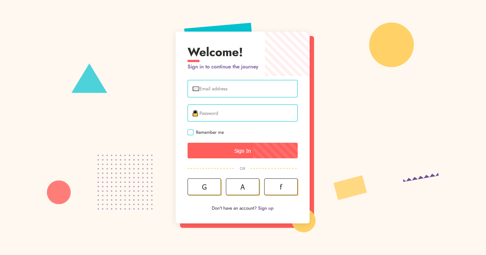

# Memphis Design Revival Login

A vibrant, playful login interface inspired by the iconic 1980s Memphis Design movement, featuring bold geometric shapes, contrasting colors, and decorative patterns that create a distinctively energetic and visually engaging user experience.

<div align="center">



</div>

## 🎨 About Memphis Design Revival

Memphis Design Revival brings back the rebellious aesthetic of the 1980s Memphis Group, characterized by its rejection of minimalism in favor of vibrant colors, geometric shapes, and playful compositions. This login interface captures the essence of this postmodern design movement with:

- Bold, contrasting colors that create visual energy and excitement
- Playful geometric shapes scattered throughout the background
- Asymmetrical layouts that break traditional grid systems
- Decorative patterns that serve aesthetic rather than functional purposes
- Layered elements that create depth and visual interest
- Animated elements that add movement and playfulness
- Distinctive dividers and separators with pattern variations
- Custom form elements that reject conventional styling

## 🖥️ Components

This implementation includes:

- Animated floating shapes (circle, triangle) with subtle movements
- Custom form inputs with floating labels and colorful focus states
- Pattern-based dividers with dashed lines
- Custom checkbox with distinctive styling
- Login button with pattern animation on hover
- Social login buttons with playful hover animations
- Decorative card elements with layered shapes and offset components
- Background pattern elements (zigzag, dots, rectangle)
- Decorative card corner pattern
- Typography with distinctive underline accents

## 🛠️ Customization

### Color Schemes

The current implementation uses a vibrant Memphis-inspired palette:

- Primary: #FF5E5B (coral red)
- Secondary: #00C2D1 (cyan blue)
- Tertiary: #FFD166 (golden yellow)
- Accent: #6A4C93 (purple)
- Background: #FFF8F0 (off-white)

Alternative Memphis-inspired color combinations:

- Primary: #01ABAA + Secondary: #FE4A49 + Accent: #7425FF
- Primary: #FF6B6B + Secondary: #4ECDC4 + Accent: #FFE66D
- Primary: #FF9E00 + Secondary: #8F3985 + Accent: #00A9A5
- Primary: #FF5964 + Secondary: #35A7FF + Accent: #CAFF8A

### Typography

This design uses:

- Jost (a clean, geometric sans-serif with subtle Memphis-appropriate characteristics)

Other suitable typefaces for Memphis Design:

- Poppins
- Futura
- ITC Bauhaus
- Memphis LT
- Paralucent

## 🔌 Usage

To implement this design in your project:

1. Copy the HTML structure
2. Include the CSS variables and styles
3. Add the JavaScript for interactive elements

```html
<!-- Core structure -->
<div class="login-wrapper">
  <!-- Decorative elements -->
  <div class="login-decorator-1"></div>
  <div class="login-decorator-2"></div>
  <div class="login-decorator-3"></div>

  <div class="login-card">
    <div class="card-pattern"></div>

    <!-- Login content -->
    <div class="login-header">
      <h1 class="login-title">Welcome!</h1>
      <p class="login-subtitle">Sign in to continue the journey</p>
    </div>

    <!-- Form elements -->
    <!-- Social buttons -->
  </div>
</div>

<!-- Background shapes -->
<div class="memphis-bg">
  <div class="shape circle circle-1"></div>
  <div class="shape triangle"></div>
  <div class="shape zigzag"></div>
  <div class="shape dots-pattern"></div>
</div>
```

```css
:root {
  --color-primary: #ff5e5b;
  --color-secondary: #00c2d1;
  --color-tertiary: #ffd166;
  --color-accent: #6a4c93;
  --color-background: #fff8f0;
  --color-dark: #2d2d2a;
  --color-light: #ffffff;
}

/* Critical styling for Memphis elements */
.shape {
  position: absolute;
  z-index: -1;
}

.circle {
  border-radius: 50%;
}

.triangle {
  width: 0;
  height: 0;
  border-left: 60px solid transparent;
  border-right: 60px solid transparent;
  border-bottom: 100px solid var(--color-secondary);
  transform: rotate(20deg);
  opacity: 0.7;
}

/* Form elements with Memphis styling */
.form-input {
  border: 2px solid var(--color-secondary);
  border-radius: 4px;
  transition: all 0.3s ease;
}

.form-input:focus {
  outline: none;
  border-color: var(--color-primary);
  box-shadow: 0 0 0 3px rgba(255, 94, 91, 0.2);
}
```

## 📚 Resources

- [Memphis Design Group History](https://www.memphis-milano.com/)
- [The Memphis Group: Design Movement](https://www.vam.ac.uk/articles/the-memphis-group)
- [Memphis Design in Modern Web](https://www.smashingmagazine.com/2017/11/memphis-design-ultimate-guide/)
- [Color Theory for Memphis Design](https://www.canva.com/learn/memphis-design/)
- [Geometric Patterns in Web Design](https://designshack.net/articles/graphics/geometric-patterns-in-web-design/)
- [Asymmetry in UI Design](https://www.nngroup.com/articles/symmetry-asymmetry/)
