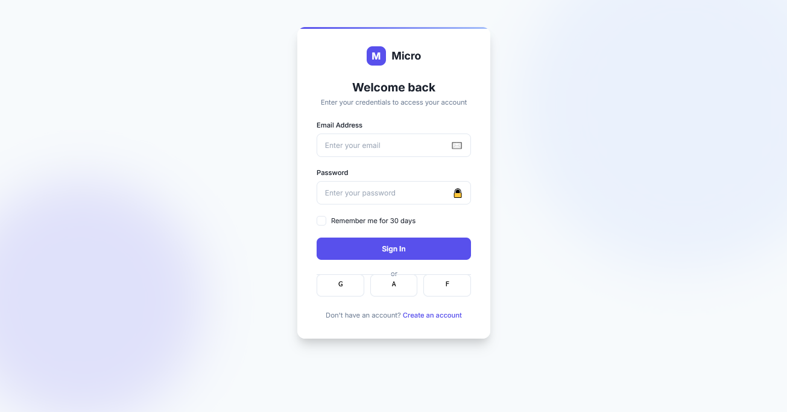

# Micro-interactions Design

A design approach that focuses on subtle animations and responsive feedback to user actions, creating an engaging and intuitive interface experience through small but meaningful interactive moments.

<div align="center">



</div>

## 🎯 About Micro-interactions Design

Micro-interactions Design enhances user experience through subtle animations and immediate feedback, making interfaces feel more responsive and alive. These small but purposeful animations guide users, confirm actions, and create emotional connections with digital products. Key characteristics include:

- Subtle animations that provide immediate feedback to user actions
- Visual cues that confirm successful operations or indicate errors
- Interactive elements that respond to hovering, clicking, or typing
- Animated transitions between different states of interface elements
- Progressive feedback during form completion or loading processes
- Animated hints that guide users through complex interactions
- Delightful details that create memorable interface moments
- Motion design that enhances usability without causing distraction

## 🖥️ Components

This implementation includes:

- Input fields with focus states and validation animations
- Buttons with ripple effects and loading states
- Custom checkbox with smooth animations
- Form validation with visual error feedback
- Animated success indicators for completed actions
- Card container with hover interactions and elevation changes
- Background elements with subtle floating animations
- Interactive links with animated underlines
- Progress indicators with state transitions
- Animated logo and icon responses

## 🛠️ Customization

### Color Schemes

The current implementation uses a purple-blue theme. Alternative micro-interaction color schemes include:

- Deep blue with teal accents for a corporate feel
- Orange and white for high-energy applications
- Green and soft white for wellness or finance applications
- Dark mode with neon accents for modern tech products
- Monochromatic grays with single accent color for minimal interfaces

### Typography

This design uses:

- Inter (clean, modern sans-serif with excellent readability)

Other appropriate fonts:

- SF Pro Display
- Circular
- Proxima Nova
- DM Sans
- Roboto

## 🔌 Usage

To implement this design in your project:

1. Copy the HTML structure
2. Include the necessary font and styles
3. Add the JavaScript for micro-interactions

```html
<link
  href="https://fonts.googleapis.com/css2?family=Inter:wght@300;400;500;600;700&display=swap"
  rel="stylesheet"
/>
<link rel="stylesheet" href="style.css" />

<div class="form-group">
  <label for="email" class="form-label">Email Address</label>
  <div class="input-wrapper">
    <input
      type="email"
      id="email"
      class="form-input"
      placeholder="Enter your email"
    />
    <div class="input-icon">✉️</div>
    <div class="success-check">✓</div>
    <div class="error-message">Please enter a valid email address</div>
  </div>
</div>

<button type="submit" id="login-btn" class="btn">
  <span class="loader"></span>
  <span class="btn-text">Sign In</span>
</button>

<script src="micro-interactions.js"></script>
```

## 📚 Resources

- [Micro-interactions: Why, When and How to Use Them](https://www.smashingmagazine.com/2021/02/micro-interactions-why-when-how/)
- [Principles of Animation in UX Design](https://uxdesign.cc/principles-of-animation-in-ux-design-5a1ab21d2823)
- [CSS Animations and Transitions](https://developer.mozilla.org/en-US/docs/Web/CSS/CSS_Animations)
- [The Importance of Motion Design in User Experience](https://www.invisionapp.com/inside-design/importance-motion-design/)
