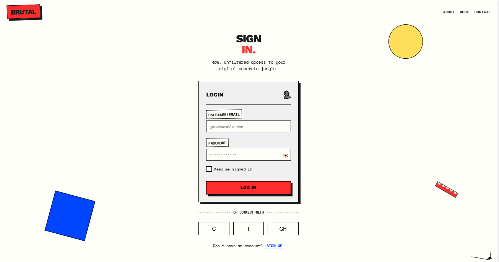

# Neo-Brutalist Login Design

A bold, raw, and deliberately unpolished login interface inspired by brutalist architecture and anti-design principles, featuring exaggerated shadows, stark borders, and playfully distorted interactive elements.

<div align="center">



</div>

## 🧱 About Neo-Brutalism in Web Design

Neo-Brutalism brings the raw, unfiltered aesthetics of brutalist architecture to digital interfaces. This design approach intentionally rejects the polished, minimal interfaces common today in favor of bold, exaggerated elements that celebrate the "honesty of materials" in digital form. Key characteristics include:

- Heavy, thick borders that make no attempt to look subtle or refined
- Harsh, offset shadows that emphasize physical presence rather than realism
- High-contrast color combinations that grab attention unapologetically
- Raw typography that prioritizes impact over traditional readability concerns
- Deliberate asymmetry and imperfections that reject conventional balance
- Exaggerated interactive states that create playful, physical-feeling feedback
- Decorative elements that serve no functional purpose except visual impact
- Intentionally unrefined layouts that expose rather than hide the underlying structure

## 🖥️ Components

This implementation includes:

- Bold login card with thick black borders and harsh shadows
- Custom form inputs with exaggerated focus states
- Deliberately unrefined checkbox styling
- Playful button animations that simulate physical movement
- Decorative geometric shapes that add visual interest
- Custom typography pairing (geometric sans + monospace)
- Raw, dashed dividers that eschew polish
- Social login buttons with impactful hover states
- Oversized, uppercase text elements
- Hand-drawn style doodles and arrows

## 🛠️ Customization

### Color Schemes

The current implementation uses a high-contrast palette with:

- Background: #fffffa (off-white)
- Accent: #ff2d2d (vivid red)
- Secondary: #0045ff (bold blue)
- Tertiary: #ffde59 (bright yellow)

Alternative brutalist color combinations include:

- Black + Yellow + White
- Bright Green + Purple + White
- Primary Red + Blue + Yellow
- Neon Pink + Black + Electric Blue

### Typography

This design pairs:

- Work Sans (Extra Bold/Black) for impactful headings
- Space Mono for the raw, technical feel of body text

Other effective neo-brutalist font combinations:

- Druk Wide + Courier New
- Archivo Black + IBM Plex Mono
- Helvetica Neue Black + Roboto Mono
- Impact + Source Code Pro

## 🔌 Usage

To implement this design in your project:

1. Copy the HTML structure
2. Include the CSS variables and styles
3. Add the JavaScript for interactive effects

```html
<!-- Critical Elements -->
<div class="login-card">
  <div class="login-card-header">
    <div class="card-title">Login</div>
    <div class="card-icon">👤</div>
  </div>

  <form class="login-form">
    <!-- Form Content -->
    <button type="submit" class="login-button">Log In</button>
  </form>
</div>

<!-- Decorative Elements -->
<div class="brutalist-element circle"></div>
<div class="brutalist-element square"></div>
<div class="brutalist-element zigzag"></div>
```

```css
:root {
  --color-bg: #fffffa;
  --color-text: #1a1a1a;
  --color-accent: #ff2d2d;
  --color-secondary: #0045ff;
  --color-tertiary: #ffde59;
  --color-form: #f0f0f0;
  --shadow-brutal: 8px 8px 0px rgba(0, 0, 0, 0.9);
  --border-brutal: 3px solid #000000;
}

/* Critical styling */
.login-card {
  background-color: var(--color-form);
  border: var(--border-brutal);
  box-shadow: var(--shadow-brutal);
  padding: 2rem;
}

.login-button {
  background-color: var(--color-accent);
  border: var(--border-brutal);
  box-shadow: var(--shadow-brutal);
  transition: transform 0.2s, box-shadow 0.2s;
}

.login-button:hover {
  transform: translate(-4px, -4px);
  box-shadow: 12px 12px 0px rgba(0, 0, 0, 0.9);
}
```

## 📚 Resources

- [Brutalist Web Design](https://brutalistwebsites.com/) - Gallery of brutalist websites
- [Neo-Brutalism in Modern Web Design](https://hype4.academy/articles/design/neobrutalism-is-taking-over-web)
- [Anti-Design: Why It's Good for UX](https://www.nngroup.com/articles/anti-design/)
- [The Principles of Neo-Brutalist Design](https://www.smashingmagazine.com/2023/09/exploring-neobrutalism-web-design/)
- [Brutalist Framework](https://brutalist.framework.com) - Resources for brutalist web design
