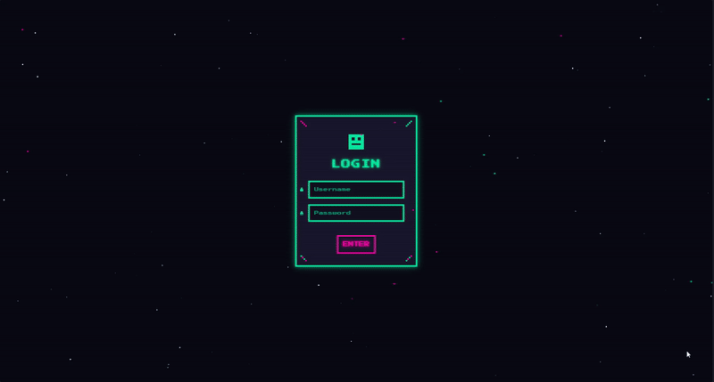

# Pixel Art / Retro Futurismo

A nostalgic pixel-based interface combining 8-bit aesthetics with cyberpunk futurism, creating an immersive digital experience reminiscent of classic gaming with a modern twist.

<div align="center">



</div>

## 🕹️ About Pixel Art / Retro Futurismo

This design style merges classic pixel art techniques with retro-futuristic cyberpunk elements, creating a unique aesthetic that's both nostalgic and forward-looking. Key characteristics include:

- Low-resolution pixel graphics with precise pixel placement
- Limited but vibrant color palettes (often neon colors against dark backgrounds)
- Retro computing visual cues and CRT screen effects
- 8-bit style iconography and UI elements
- Synthwave/cyberpunk atmospheric elements
- Grid-based layouts with pixel-perfect alignment

## 🖥️ Components

This implementation includes:

- Animated starfield background with twinkling stars
- CRT screen effects (scanlines and subtle flicker)
- Custom pixel art avatar and decorative elements
- Pixelated form controls with authentic 8-bit styling
- Terminal-style blinking cursors and text effects
- Floating pixel particles for visual depth
- Authentic pixel art borders and corner decorations

## 🛠️ Customization

### Color Schemes

The current implementation uses a cyberpunk-inspired palette. Alternative pixel art color schemes include:

- Gameboy palette (4 shades of green)
- NES palette (limited 54-color palette)
- EGA/CGA classic computer palettes
- Commodore 64 16-color palette
- Custom synthwave palette (purples and blues)

### Typography

This design uses:

- Press Start 2P (authentic 8-bit style font)

Other appropriate pixel art fonts:

- VT323
- Silkscreen
- Pixeled
- Munro
- Perfect DOS VGA

## 🔌 Usage

To implement this design in your project:

1. Copy the HTML structure
2. Include the necessary font and styles
3. Adjust the pixel art elements as needed

```html
<link
  href="https://fonts.googleapis.com/css2?family=Press+Start+2P&display=swap"
  rel="stylesheet"
/>
<link rel="stylesheet" href="style.css" />

<div class="login-container">
  <div class="pixel-decoration decoration-1"></div>
  <div class="pixel-decoration decoration-2"></div>
  <div class="login-header">
    <div class="pixel-art-avatar"></div>
    <h1>Your Title</h1>
  </div>
</div>
```

## 📚 Resources

- [Pixel Art Techniques](https://lospec.com/pixel-art-tutorials)
- [Color Palette Resources](https://lospec.com/palette-list)
- [Press Start 2P Font](https://fonts.google.com/specimen/Press+Start+2P)
