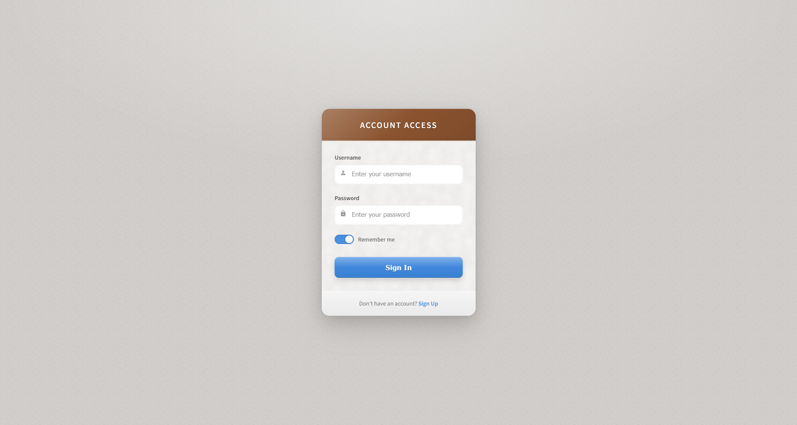

# Skeuomorphism 2.0

A modern revival of realistic interface design that simulates physical materials and textures while maintaining contemporary usability principles and refined aesthetics.

<div align="center">



</div>

## 📱 About Skeuomorphism 2.0

Skeuomorphism 2.0 reimagines the realistic design approach popular in early digital interfaces with more restraint and sophistication. Key characteristics include:

- Realistic textures and materials (leather, paper, metal, etc.)
- Subtle shadows and highlights creating perceived depth
- Physical feedback through visual cues
- Dimensional UI elements that mimic real-world objects
- Light reflection and environmental effects
- Tactile controls that suggest physical interaction
- Refined color palette inspired by natural materials

## 🖥️ Components

This implementation includes:

- Textured card interface with simulated materials
- 3D perspective effects and subtle tilt response
- Realistic form controls with depth and shadows
- Toggle switch with physical movement simulation
- Buttons with pressure feedback
- Light source simulation affecting all elements
- Stitching and material edge details
- Paper and leather texture patterns

## 🛠️ Customization

### Material Themes

The current implementation uses a paper and leather theme. Alternative material combinations include:

- Metal and glass
- Wood and fabric
- Concrete and brass
- Brushed aluminum and rubber
- Dark leather and carbon fiber

### Typography

This design uses:

- Source Sans Pro (clean, modern sans-serif)

Other appropriate fonts:

- Proxima Nova
- Avenir
- San Francisco
- Lato
- Roboto

## 🔌 Usage

To implement this design in your project:

1. Copy the HTML structure
2. Include the necessary font and styles
3. Maintain the physical material principles

```html
<link
  href="https://fonts.googleapis.com/css2?family=Source+Sans+Pro:wght@400;600&display=swap"
  rel="stylesheet"
/>
<link rel="stylesheet" href="style.css" />

<div class="login-card">
  <div class="card-header">
    <h2 class="header-title">Your Title</h2>
  </div>
  <div class="card-body"></div>
  <div class="card-footer"></div>
</div>
```

## 📚 Resources

- [The Evolution of Skeuomorphism](https://www.toptal.com/designers/ui/skeuomorphic-design)
- [Material Design and Physical Textures](https://material.io/design/introduction)
- [Creating Realistic Textures in Web Design](https://www.smashingmagazine.com/2015/07/authentic-design/)
