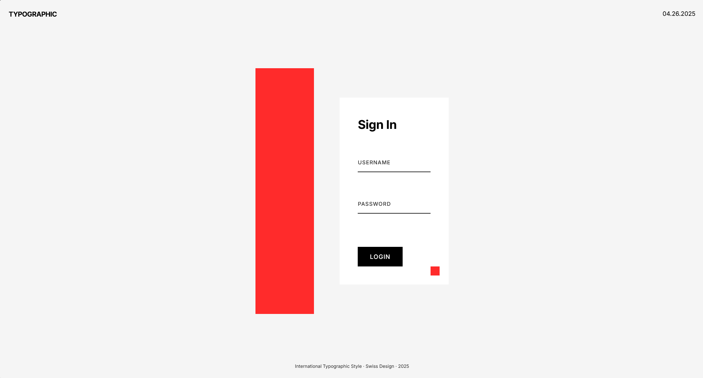

# Swiss / Tipográfico Puro

A minimalist design approach based on the International Typographic Style (Swiss Style), featuring clean grid layouts, precise typography, and objective presentation principles.

<div align="center">



</div>

## 📚 About Swiss / Tipográfico Puro

The Swiss Design style, also known as International Typographic Style, emerged in Switzerland in the 1950s and continues to influence modern design. Key characteristics include:

- Strict adherence to grid-based layouts
- Clean, objective visual presentation
- Precise typographic hierarchy
- Generous use of negative space
- Mathematical proportions and geometric elements
- Limited color palette (typically black, white, and red)
- Sans-serif typography with careful attention to spacing

## 🖥️ Components

This implementation includes:

- Mathematical grid system with visible grid markers
- Asymmetrical layout following grid principles
- Minimal color palette with intentional accent color
- Clean form fields with floating label animations
- Typographic scale based on proportional relationships
- Geometric decorative elements
- Responsive design that maintains grid integrity

## 🛠️ Customization

### Color Schemes

The current implementation uses the classic Swiss color palette. Alternative options include:

- Black and white only
- Black, white, and blue
- Grayscale with red accents
- Primary colors (red, blue, yellow) with black and white

### Typography

This design uses:

- Inter (modern take on Swiss sans-serif)

Other appropriate Swiss-style fonts:

- Helvetica / Helvetica Neue
- Akzidenz-Grotesk
- Univers
- Neue Haas Grotesk
- Arial (web-safe alternative)

## 🔌 Usage

To implement this design in your project:

1. Copy the HTML structure
2. Include the necessary font and styles
3. Maintain the grid system and typographic rules

```html
<link
  href="https://fonts.googleapis.com/css2?family=Inter:wght@400;500;700&display=swap"
  rel="stylesheet"
/>
<link rel="stylesheet" href="style.css" />

<div class="login-container">
  <h1>Your Title</h1>
  <div class="form-input">
    <input
      type="text"
      class="input-field"
      id="field-name"
      placeholder="Label"
      required
    />
    <label for="field-name" class="input-label">Label</label>
  </div>
</div>
```

## 📚 Resources

- [International Typographic Style](https://en.wikipedia.org/wiki/International_Typographic_Style)
- [Swiss Style: The Principles, Typefaces & Designers](https://www.designishistory.com/1940/swiss-design/)
- [Josef Müller-Brockmann - Grid Systems](https://www.amazon.com/Grid-Systems-Graphic-Design-Communication/dp/3721201450)
