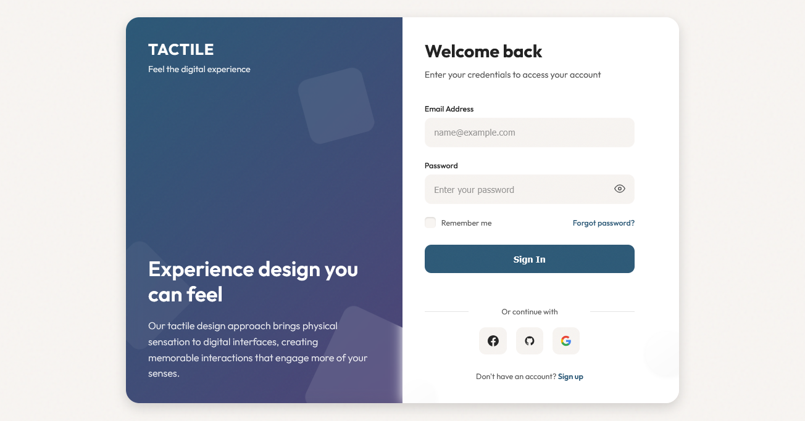

# Tactile Digital Login

A sensory-rich login interface that bridges physical and digital experiences, featuring textured surfaces, dimensional elements, and haptic feedback simulations that create a tangible user experience reminiscent of physical materials and interactions in a digital context.

<div align="center">



</div>

## 👋 About Tactile Digital

Tactile Digital design creates interfaces that evoke a sense of physical touch and materiality in digital environments:

- Textured surfaces with subtle noise patterns that mimic real-world materials
- Dimensional elements with carefully crafted shadows and highlights
- Simulated physical feedback that responds naturally to user interaction
- Layered components that establish realistic depth and spatial relationships
- Interactive elements that behave like their physical counterparts
- Material-inspired color palettes that evoke familiar textures and surfaces
- Subtle animations that mimic the physics of real-world objects
- Microinteractions that provide sensory feedback to user actions
- Visual weight that creates a sense of mass and physical presence
- Soft gradients and lighting effects that enhance depth perception

This approach creates interfaces that feel more substantial and engaging by leveraging our innate understanding of how physical objects look, feel, and behave, resulting in more intuitive and memorable user experiences.

## 🖥️ Components

This implementation includes:

- Textured backgrounds with subtle noise patterns for tactile quality
- Floating circular elements that create dimensional layering
- Form inputs with textured surfaces and realistic focus states
- Custom checkbox with physical toggle behavior
- Interactive buttons with realistic depression animations
- Gradient panels with material-inspired lighting
- Dividers with subtle depth and shadow
- Interactive links with physical underline animations
- Social buttons with elevation changes on hover
- Semi-transparent shapes with realistic blur effects
- Responsive design that maintains tactile qualities across devices
- Simulated physical feedback through subtle animations

## 🛠️ Customization

### Color Schemes

The current implementation uses a serene tactile palette:

- Background: #f8f5f2 (off-white paper texture)
- Surface: #ffffff (clean white surface)
- Primary: #2b5876 (deep blue)
- Secondary: #4e4376 (purple)
- Text: #232323 (near black) and #565656 (medium gray)
- Accent: #ff7e5f (coral)

Alternative tactile color combinations:

- Natural: Earthy browns, greens, and clay tones
- Material: Concrete grays, wood browns, and steel blues
- Fabric: Soft cotton whites, denim blues, and linen tans
- Ceramic: Porcelain whites, terracotta, and glazed blues
- Paper: Parchment, kraft paper brown, and ink black

### Typography

This design uses:

- Outfit (sans-serif) for all text elements with varying weights

Other effective tactile typography options:

- Inter (modern sans-serif with excellent readability)
- Literata (serif with physical presence)
- Work Sans (geometric with material quality)
- Fraunces (serif with tactile character)
- DM Sans (neutral with good weight variation)

## 🔌 Usage

To implement this design in your project:

1. Include the CSS with variables and textures
2. Add the Google Font 'Outfit'
3. Copy the HTML structure
4. Add the JavaScript for tactile interactions

```html
<!DOCTYPE html>
<html lang="en">
  <head>
    <meta charset="UTF-8" />
    <meta name="viewport" content="width=device-width, initial-scale=1.0" />
    <title>Tactile Digital Login</title>
    <link
      href="https://fonts.googleapis.com/css2?family=Outfit:wght@300;400;500;600;700&display=swap"
      rel="stylesheet"
    />
    <link rel="stylesheet" href="style.css" />
  </head>
  <body>
    <div class="login-container">
      <!-- Tactile decorative elements -->
      <div class="tactile-element tactile-element-1"></div>
      <div class="tactile-element tactile-element-2"></div>
      <div class="tactile-element tactile-element-3"></div>

      <!-- Visual panel -->
      <div class="visual-panel">
        <!-- Panel content -->
      </div>

      <!-- Login form panel -->
      <div class="login-panel">
        <!-- Login form -->
      </div>
    </div>

    <script src="script.js"></script>
  </body>
</html>
```

## 📚 Resources

- [The Psychology of Haptic Feedback](https://www.smashingmagazine.com/2021/02/designing-better-toasts-notifications/)
- [Material Design: Elevation & Shadows](https://material.io/design/environment/elevation.html)
- [Designing for Touch: Physical Interfaces](https://www.uxmatters.com/mt/archives/2013/09/designing-for-touch-the-feel-of-tangible-interactions.php)
- [Textures in UI Design](https://www.designbetter.co/design-systems-handbook/introducing-design-systems)
- [Microinteractions: Designing with Details](https://www.amazon.com/Microinteractions-Designing-Details-Dan-Saffer/dp/1491945923)
- [The Guide to Realistic UI Design](https://www.toptal.com/designers/ui/realistic-ui-design)
