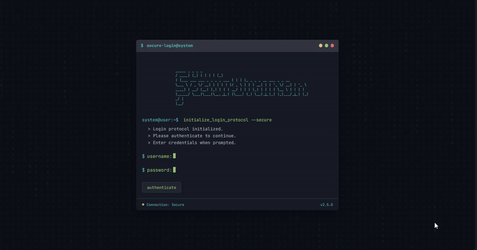

# Terminal/Command Line Aesthetic

A nostalgic interface design that emulates the look and feel of text-based computer terminals, featuring monospaced fonts, command prompt interactions, and hacker-inspired visual elements.

<div align="center">



</div>

## 🎯 About Terminal/Command Line Aesthetic

Terminal/Command Line Aesthetic brings the nostalgic charm of early computing interfaces to modern web design. This style pays homage to text-based computer terminals and command-line interfaces from the early days of computing, creating experiences that feel technical, authentic, and purposefully minimalist. Key characteristics include:

- Monospaced fonts that mimic classic terminal typefaces
- Dark backgrounds with high-contrast text colors (often green or amber)
- Command prompt style interactions with typed responses
- Blinking cursors and typing animations that simulate real terminals
- ASCII art graphics instead of conventional images
- Matrix-inspired visual effects and simple animations
- Stark minimalism focused primarily on typography and function
- Terminal-style feedback for user actions and system responses
- Code-like syntax highlighting and command structures
- Retro computing visual cues like scan lines or CRT monitor effects

## 🖥️ Components

This implementation includes:

- Terminal-style window with realistic header controls
- ASCII art logo for text-based branding
- Command prompt interfaces with animated responses
- Blinking cursor animation that follows input focus
- Matrix-inspired background animation
- Simulated typing and command execution
- Progress indicators mimicking terminal operations
- Error handling with typical command-line feedback
- Terminal window scrolling with command history
- Form inputs designed as command-line parameters

## 🛠️ Customization

### Color Schemes

The current implementation uses a green/blue on dark theme. Alternative terminal color schemes include:

- Green on black (classic terminal)
- Amber on black (vintage terminal)
- White on blue (DOS/BIOS inspired)
- Purple and pink (synthwave/cyberpunk terminal)
- Grey and white (modern minimal terminal)
- Custom syntax highlighting schemes mimicking popular terminal themes

### Typography

This design uses:

- JetBrains Mono (modern monospace with excellent readability)

Other appropriate fonts:

- IBM Plex Mono
- Fira Code
- Courier Prime
- Source Code Pro
- Ubuntu Mono

## 🔌 Usage

To implement this design in your project:

1. Use a monospaced font for all text elements
2. Create a terminal-like container with appropriate styling
3. Implement typing animations for dynamic text
4. Add terminal-style input fields with blinking cursors

```html
<!-- Terminal Container Example -->
<div class="terminal">
  <div class="terminal-header">
    <div class="terminal-title">
      <span>$</span>
      <span>user@system</span>
    </div>
    <div class="terminal-controls">
      <div class="control-dot control-close"></div>
      <div class="control-dot control-minimize"></div>
      <div class="control-dot control-maximize"></div>
    </div>
  </div>

  <div class="terminal-body">
    <p class="terminal-line">
      <span class="terminal-prompt">user@system:~$</span>
      <span class="terminal-command">login --secure</span>
    </p>

    <div class="terminal-form">
      <div class="terminal-input-group">
        <span class="terminal-prompt-symbol">$</span>
        <label for="username" class="blinking-cursor">username:</label>
        <input type="text" id="username" class="terminal-input" />
      </div>
    </div>
  </div>
</div>
```

```css
:root {
  --bg: #0d1117;
  --text: #98c379;
  --terminal-bg: #161b22;
  --border: #30363d;
  --cursor: #98c379;
}

body {
  background-color: var(--bg);
  color: var(--text);
  font-family: "JetBrains Mono", monospace;
}

.terminal {
  background-color: var(--terminal-bg);
  border-radius: 6px;
  box-shadow: 0 10px 30px rgba(0, 0, 0, 0.4);
  overflow: hidden;
}

/* Blinking cursor animation */
.blinking-cursor::after {
  content: "";
  width: 8px;
  height: 18px;
  background-color: var(--cursor);
  animation: blink 1s step-end infinite;
}

@keyframes blink {
  0%,
  100% {
    opacity: 1;
  }
  50% {
    opacity: 0;
  }
}
```

## 📚 Resources

- [A Brief History of Command Line Interfaces](https://www.wired.com/story/command-line-heroes/)
- [Designing Terminal-inspired Interfaces](https://css-tricks.com/terminal-command-line-interfaces-web-apps/)
- [ASCII Art Generation Tools](http://patorjk.com/software/taag/)
- [CSS Terminal UI Libraries](https://github.com/topics/terminal-ui)
- [Monospace Typography Best Practices](https://www.smashingmagazine.com/2016/05/proper-use-of-monospace-fonts/)
